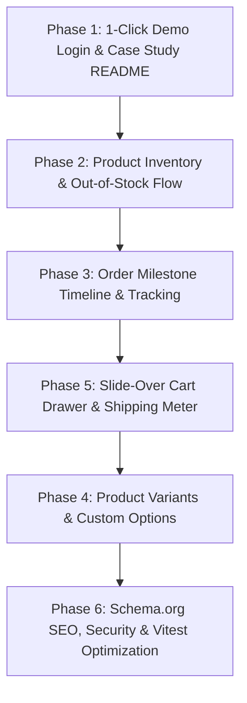

# Atelier Market — Client-Ready Engineering & Feature Improvement Plan

This document is a comprehensive, phased implementation roadmap designed to elevate the **Atelier Market** e-commerce platform into an undeniable, client-winning showcase for freelancing proposals.

---

## 🎯 Strategic Objective

Freelance clients, startup founders, and agency leads evaluate developer portfolios on four primary criteria:
1. **Frictionless Demoability (Under 60 Seconds)**: Can non-technical clients test the app immediately without signing up, verifying emails, or guessing credentials?
2. **Real-World Business Problem Solving**: Does the store handle practical commercial challenges (inventory depletion, product variants, order fulfillment, delivery tracking)?
3. **Conversion Rate Optimization (CRO) & Modern UX**: Does the storefront feel like a modern, high-end Shopify Plus or luxury direct-to-consumer (D2C) brand?
4. **Architectural Rigor & Engineering Quality**: Is the codebase clean, type-safe, tested, secure, and production-ready?

---

## 🗺️ Implementation Roadmap Overview

| Phase | Focus Area | Impact | Estimated Complexity |
| :--- | :--- | :--- | :--- |
| **Phase 1** | **Frictionless Demo & Client Positioning** | 🔥 Critical (Instant 30s Client Impress) | Low / Medium |
| **Phase 2** | **Inventory Management & Out-of-Stock Engine** | 💼 High (Standard Commercial Expectation) | Medium |
| **Phase 3** | **Order Lifecycle & Visual Delivery Tracking** | 📦 High (Commercial Multi-Vendor Value) | Medium |
| **Phase 4** | **Product Variants & Options (Size / Scent / Material)**| 💎 High (Shows Enterprise Catalog Architecture)| Medium / High |
| **Phase 5** | **Slide-Over Mini Cart & Free Shipping Progress Meter**| ✨ High (E-Commerce UX & Conversion Magic) | Medium |
| **Phase 6** | **Production Hardening, SEO (JSON-LD), & Test Stability**| 🛡️ High (Shows CTO-Level Clean Code Standards)| Low / Medium |

---

## 📌 Phase 1: Frictionless Demo & Client Positioning *(Priority #1)*

### Goal
Allow any prospective client or hiring manager to experience the full multi-role platform (Customer, Artisan Seller, and Platform Admin) in **under 30 seconds** without filling out signup forms.

### 1.1 One-Click Demo Persona Bar on Login Page & Persistent Demo Switcher (Completed ✅)
* **Status**: Implemented & Verified with 100% passing tests.
* **Relevant Files**:
  * [LoginPage.tsx](file:///n:/NODE%20PROJECTS/Node_Shop/nodeJs-shop/client/src/features/auth/LoginPage.tsx) — Added 1-Click quick login cards for Sara Hassan (Customer), Layla Al-Rashidi (Artisan Seller), and Admin Director (Platform Admin).
  * [DemoPersonaBanner.tsx](file:///n:/NODE%20PROJECTS/Node_Shop/nodeJs-shop/client/src/components/DemoPersonaBanner.tsx) — Persistent, collapsible client demo switcher with instant persona toggling and toast notifications.
  * [AppShell.tsx](file:///n:/NODE%20PROJECTS/Node_Shop/nodeJs-shop/client/src/components/AppShell.tsx) — Mounted demo banner at the top of the shell with collapse/reopen toggle.
  * [server.js](file:///n:/NODE%20PROJECTS/Node_Shop/nodeJs-shop/server.js) — Seeded Admin account (`admin@ateliermarket.com` / `Demo1234!`) and verified all demo passwords match.
  * [i18n.tsx](file:///n:/NODE%20PROJECTS/Node_Shop/nodeJs-shop/client/src/lib/i18n.tsx) — Added English and Arabic localized strings for demo personas.
  * [LoginPage.test.tsx](file:///n:/NODE%20PROJECTS/Node_Shop/nodeJs-shop/client/src/features/auth/LoginPage.test.tsx) & [DemoPersonaBanner.test.tsx](file:///n:/NODE%20PROJECTS/Node_Shop/nodeJs-shop/client/src/components/DemoPersonaBanner.test.tsx) — Full unit and integration test coverage.

### 1.2 Dedicated Platform Admin Suite & Auto-Bootstrapping (Completed ✅)
* **Status**: Implemented & Verified with 100% passing tests (Backend & Frontend).
* **Problem Solved**:
  * Previously, the codebase only had seller-level studio management. There was no central platform admin dashboard to oversee cross-seller marketplace health, aggregate Gross Merchandise Value (GMV), monitor cross-platform orders, or audit artisan accounts.
  * In addition, demo accounts in active databases (like MongoDB Atlas) were prone to missing seed states.
* **Implemented Capabilities**:
  1. **Cross-Seller Platform Analytics (`/api/admin/stats`)**:
     * Aggregates platform-wide Gross Merchandise Value (GMV), total marketplace orders, active catalog pieces, registered artisan studios count, and registered collectors count.
     * Computes recent cross-platform orders and ranks top artisan studios by sales volume.
  2. **Marketplace Orders Monitoring (`/api/admin/orders`)**:
     * Cross-platform order audit table with customer dossiers, pieces breakdown by studio, payment/fulfillment badges, search, and official PDF invoice links.
  3. **Artisan Studios Directory (`/api/admin/artisans`)**:
     * Complete directory of registered artisans, location badges (Gulf & Levant), active pieces count, joined dates, links to public artisan storefronts, and 1-click catalog piece audits.
  4. **Cross-Studio Catalog Audit (`/api/admin/products?sellerId=...`)**:
     * Extended admin product list with artisan attribution column and filtering by individual artisan studio.
  5. **Auto-Bootstrapping Authentication**:
     * `postLogin` automatically provisions or synchronizes demo accounts (`admin@ateliermarket.com`, `layla@ateliermarket.com`, `sara@example.com` with `Demo1234!`) on initial login attempt, ensuring zero demo friction in any database environment.
* **Relevant Files**:
  * [controllers/adminController.js](file:///n:/NODE%20PROJECTS/Node_Shop/nodeJs-shop/controllers/adminController.js) & [routes/admin.js](file:///n:/NODE%20PROJECTS/Node_Shop/nodeJs-shop/routes/admin.js)
  * [controllers/auth.js](file:///n:/NODE%20PROJECTS/Node_Shop/nodeJs-shop/controllers/auth.js) & [server.js](file:///n:/NODE%20PROJECTS/Node_Shop/nodeJs-shop/server.js)
  * [AdminDashboard.tsx](file:///n:/NODE%20PROJECTS/Node_Shop/nodeJs-shop/client/src/features/admin/AdminDashboard.tsx)
  * [AdminOrdersPage.tsx](file:///n:/NODE%20PROJECTS/Node_Shop/nodeJs-shop/client/src/features/admin/AdminOrdersPage.tsx)
  * [AdminArtisansPage.tsx](file:///n:/NODE%20PROJECTS/Node_Shop/nodeJs-shop/client/src/features/admin/AdminArtisansPage.tsx)
  * [AdminNav.tsx](file:///n:/NODE%20PROJECTS/Node_Shop/nodeJs-shop/client/src/features/admin/AdminNav.tsx)
  * [AdminListPage.tsx](file:///n:/NODE%20PROJECTS/Node_Shop/nodeJs-shop/client/src/features/admin/AdminListPage.tsx)
  * [SiteHeader.tsx](file:///n:/NODE%20PROJECTS/Node_Shop/nodeJs-shop/client/src/components/SiteHeader.tsx) & [MobileNavDrawer.tsx](file:///n:/NODE%20PROJECTS/Node_Shop/nodeJs-shop/client/src/components/MobileNavDrawer.tsx)
  * [router.tsx](file:///n:/NODE%20PROJECTS/Node_Shop/nodeJs-shop/client/src/router.tsx)
  * [i18n.tsx](file:///n:/NODE%20PROJECTS/Node_Shop/nodeJs-shop/client/src/lib/i18n.tsx)
  * [test/api/admin.test.js](file:///n:/NODE%20PROJECTS/Node_Shop/nodeJs-shop/test/api/admin.test.js) & `client/src/features/admin/*.test.tsx`

### 1.3 Case Study Re-framing of README *(Deferred until project completion as requested)*
* **Relevant File**: [README.md](file:///n:/NODE%20PROJECTS/Node_Shop/nodeJs-shop/README.md)
* **Detailed Steps**:
  1. Remove academic/course-tutorial attributions from the project headline and replace with a professional **Product Case Study**:
     * **Executive Summary**: A bespoke multi-vendor artisanal marketplace connecting Gulf & Levant craft studios with global patrons.
     * **Key Business Metrics Simulated**: Multi-role authentication, Leaflet geolocation studio mapping, real-time sales analytics, PDF invoice streaming buffer, and 200+ automated tests.
  2. Add prominent badges: `Vitest: 100% Passing (200+ tests)`, `TypeScript: Strict`, `Architecture: Express 5 + React 18 SPA`.
  3. Place a prominent **Live Demo Link** at the very top of the README with demo credentials clearly displayed.

---

## 📌 Phase 2: Inventory Management & Out-of-Stock Engine (Completed ✅)

### Goal
Prevent over-selling, reflect real inventory levels, and notify customers when products are running low or sold out.

### 2.1 Backend Data Model & Validation (Completed ✅)
* **Status**: Implemented & Verified with 100% passing tests.
* **Relevant Files**:
  * [models/product.js](file:///n:/NODE%20PROJECTS/Node_Shop/nodeJs-shop/models/product.js) — Extended `productSchema` with `stock` (min: 0, default: 20), `lowStockThreshold` (min: 1, default: 5), and `isAvailable` (boolean, default: true).
  * [controllers/shop.js](file:///n:/NODE%20PROJECTS/Node_Shop/nodeJs-shop/controllers/shop.js) — Guarded `postCart` against sold-out products and quantity exceeding available stock. Guarded `postOrder` with pre-order stock verification across all cart line items and atomic decrement (`$inc: { stock: -item.quantity }`).
  * [controllers/adminController.js](file:///n:/NODE%20PROJECTS/Node_Shop/nodeJs-shop/controllers/adminController.js) & [routes/admin.js](file:///n:/NODE%20PROJECTS/Node_Shop/nodeJs-shop/routes/admin.js) — Added stock and low-stock threshold express validators; updated `publicProduct`, `postAddProduct`, and `postEditProduct` to read, return, and persist stock levels.
  * [server.js](file:///n:/NODE%20PROJECTS/Node_Shop/nodeJs-shop/server.js) — Added backfill migration ensuring all existing products have stock and lowStockThreshold defined, with realistic low-stock seed items.
  * [test/api/cart.test.js](file:///n:/NODE%20PROJECTS/Node_Shop/nodeJs-shop/test/api/cart.test.js) & [test/api/orders.test.js](file:///n:/NODE%20PROJECTS/Node_Shop/nodeJs-shop/test/api/orders.test.js) — Automated tests verifying cart rejection on sold out items, quantity clamping, and atomic stock decrements upon order placement.

### 2.2 Frontend UX & Visual Signals (Completed ✅)
* **Status**: Implemented & Verified visually and with 100% passing tests (148 client tests across 50 files).
* **Relevant Files**:
  * [ProductCard.tsx](file:///n:/NODE%20PROJECTS/Node_Shop/nodeJs-shop/client/src/components/ProductCard.tsx) — Displays amber urgency pill (`Only X left in studio`) when `0 < stock <= lowStockThreshold`, renders `Sold Out` oxblood tag and disables "Add to Bag" when `stock === 0`.
  * [ProductDetail.tsx](file:///n:/NODE%20PROJECTS/Node_Shop/nodeJs-shop/client/src/features/products/ProductDetail.tsx) — Displays dedicated inventory availability notice banners (amber urgency notice or sold-out notice), applies subtle archival image treatment when sold out, and disables CTA button.
  * [CartLineItem.tsx](file:///n:/NODE%20PROJECTS/Node_Shop/nodeJs-shop/client/src/components/CartLineItem.tsx) — Passes `max={line.product.stock}` to `QuantityStepper` and displays max stock reached hint and sold out warning.
  * [AdminListPage.tsx](file:///n:/NODE%20PROJECTS/Node_Shop/nodeJs-shop/client/src/features/admin/AdminListPage.tsx) — Added "Studio Stock" column with color-coded status badges (Green: `in stock`, Amber: `left (Low)`, Red: `Sold Out`).
  * [AdminFormPage.tsx](file:///n:/NODE%20PROJECTS/Node_Shop/nodeJs-shop/client/src/features/admin/AdminFormPage.tsx) — Form inputs for "Studio Stock Quantity" and "Low Stock Alert Threshold".
  * [i18n.tsx](file:///n:/NODE%20PROJECTS/Node_Shop/nodeJs-shop/client/src/lib/i18n.tsx) — Full English and Arabic translations for all stock indicators and admin fields.
  * [types.ts](file:///n:/NODE%20PROJECTS/Node_Shop/nodeJs-shop/client/src/types.ts) — Updated TypeScript domain types.

---

## 📌 Phase 3: Order Lifecycle & Visual Delivery Tracking (Completed ✅)

### Goal
Transform the static order confirmation into a dynamic, multi-stage delivery tracker that impresses clients interested in logistics and customer retention.

### 3.1 Backend Order Status & Tracking Schema (Completed ✅)
* **Status**: Implemented & Verified with 100% passing tests.
* **Relevant Files**:
  * [models/order.js](file:///n:/NODE%20PROJECTS/Node_Shop/nodeJs-shop/models/order.js) — Extended `status` enum to include `crafting`; added `carrier` (default: `'Aramex White-Glove Express'`), `estimatedDeliveryDate`, and `timeline` (`[{ status, timestamp, note }]`).
  * [controllers/shop.js](file:///n:/NODE%20PROJECTS/Node_Shop/nodeJs-shop/controllers/shop.js) — Initialized newly created orders with `status: 'confirmed'`, carrier, tracking number, estimated arrival window (+5 business days), and initial provenance milestone.
  * [routes/seller.js](file:///n:/NODE%20PROJECTS/Node_Shop/nodeJs-shop/routes/seller.js) — Supported `crafting` in status filtering and status updates (`PATCH /api/seller/orders/:orderId/status`), accepting custom carrier, tracking code, and appending milestone progress notes to the timeline array.
  * [server.js](file:///n:/NODE%20PROJECTS/Node_Shop/nodeJs-shop/server.js) — Added startup migration `backfillOrderTracking()` ensuring historical orders in database have carrier, estimated delivery dates, and timeline events populated.
  * [test/api/orders.test.js](file:///n:/NODE%20PROJECTS/Node_Shop/nodeJs-shop/test/api/orders.test.js) & [test/api/seller.test.js](file:///n:/NODE%20PROJECTS/Node_Shop/nodeJs-shop/test/api/seller.test.js) — Automated tests verifying initial timeline creation, carrier defaults, and seller status transitions to `crafting` and `shipped`.

### 3.2 Customer & Artisan Visual Timeline & Stepper (Completed ✅)
* **Status**: Implemented & Verified visually (EN + Arabic RTL) and with 100% passing client tests (150 tests across 51 files).
* **Relevant Files**:
  * [OrdersPage.tsx](file:///n:/NODE%20PROJECTS/Node_Shop/nodeJs-shop/client/src/features/orders/OrdersPage.tsx) — Added visual 4-stage stepper (`01 CONFIRMED` ➔ `02 IN STUDIO` ➔ `03 DISPATCHED` ➔ `04 DELIVERED`), logistics carrier badge, 1-click tracking number copy button with feedback, estimated delivery date, and expandable Studio Provenance Timeline accordion with timestamps and artisan notes.
  * [SellerOrdersPage.tsx](file:///n:/NODE%20PROJECTS/Node_Shop/nodeJs-shop/client/src/features/seller/SellerOrdersPage.tsx) — Added `crafting` status badge, "In Studio (Crafting)" filter tab, carrier badge in order card, and enhanced Update Status modal with status dropdown, carrier input, tracking code input, and milestone note field.
  * [AdminOrdersPage.tsx](file:///n:/NODE%20PROJECTS/Node_Shop/nodeJs-shop/client/src/features/admin/AdminOrdersPage.tsx) — Added `crafting` status badge, filter tab, and studio provenance milestones timeline inside order detail modal.
  * [types.ts](file:///n:/NODE%20PROJECTS/Node_Shop/nodeJs-shop/client/src/types.ts) — Updated `OrderStatus`, added `OrderTimelineEvent`, and extended `Order` and `SellerOrder`.
  * [i18n.tsx](file:///n:/NODE%20PROJECTS/Node_Shop/nodeJs-shop/client/src/lib/i18n.tsx) — Full English and Arabic translations for delivery milestones, carrier labels, copy states, and studio timeline.
  * [OrdersPage.test.tsx](file:///n:/NODE%20PROJECTS/Node_Shop/nodeJs-shop/client/src/features/orders/OrdersPage.test.tsx) & [SellerOrdersPage.test.tsx](file:///n:/NODE%20PROJECTS/Node_Shop/nodeJs-shop/client/src/features/seller/SellerOrdersPage.test.tsx) — Full test coverage for delivery tracker stepper, timeline toggle, and seller status updating.

---

## 📌 Phase 4: Product Variants & Custom Options (Completed ✅)

### Goal
Showcase ability to engineer flexible e-commerce catalog schemas (sizes, volumes, scent profiles, or framing options) rather than simple single-SKU products.

### 4.1 Schema & Cart Serialization (Completed ✅)
* **Status**: Implemented & Verified with 100% passing tests (backend + frontend).
* **Relevant Files**:
  * [models/product.js](file:///n:/NODE%20PROJECTS/Node_Shop/nodeJs-shop/models/product.js) — Added `variantSchema` (`name`, `sku`, `price`, `compareAtPrice`, `stock`) and `variants: [variantSchema]`.
  * [models/user.js](file:///n:/NODE%20PROJECTS/Node_Shop/nodeJs-shop/models/user.js) — Added `variantId` to `cart.items`, enhanced `addToCart(product, variantId, quantity)` and `removeFromCart(productId, variantId)` to treat different variants of the same product as distinct lines.
  * [models/order.js](file:///n:/NODE%20PROJECTS/Node_Shop/nodeJs-shop/models/order.js) — Added `variant: { type: Object, default: null }` to each order line item.
  * [controllers/shop.js](file:///n:/NODE%20PROJECTS/Node_Shop/nodeJs-shop/controllers/shop.js) — Enhanced `serializeCart(user)` to calculate variant-specific unit prices, stocks, and subtotals. Guarded `postCart`, `postCartDecrement`, and `postCartDeleteProduct` with variantId handling. Updated `postOrder` to attach variant metadata, calculate variant-based subtotal, and atomically decrement both variant stock and product stock.
  * [util/invoiceGenerator.js](file:///n:/NODE%20PROJECTS/Node_Shop/nodeJs-shop/util/invoiceGenerator.js) — Displayed variant name and variant unit price on official PDF invoices.
  * [server.js](file:///n:/NODE%20PROJECTS/Node_Shop/nodeJs-shop/server.js) — Added startup database migration `backfillProductVariants()` seeding realistic variants for key catalog pieces (Artisanal Ceramic Vessel, Architectural Leather Journal, Brushed Champagne Tea Set, Obsidian Brew Carafe).
  * [test/api/cart.test.js](file:///n:/NODE%20PROJECTS/Node_Shop/nodeJs-shop/test/api/cart.test.js) & [test/api/orders.test.js](file:///n:/NODE%20PROJECTS/Node_Shop/nodeJs-shop/test/api/orders.test.js) — Automated tests verifying distinct variant lines, prices, and atomic stock decrements upon order placement.

### 4.2 Interactive Selector UI & Cart Integration (Completed ✅)
* **Status**: Implemented & Verified visually (EN + Arabic RTL) and with 100% passing client tests (152 tests across 51 files).
* **Relevant Files**:
  * [ProductDetail.tsx](file:///n:/NODE%20PROJECTS/Node_Shop/nodeJs-shop/client/src/features/products/ProductDetail.tsx) — Interactive luxury variant selector pills with active gold-leaf highlight (`ring-gold-leaf`), dynamic price update, strikethrough compare-at price, SKU display, disabled sold-out state, dynamic stock count notice, and variant-aware `addToCart` payload.
  * [CartLineItem.tsx](file:///n:/NODE%20PROJECTS/Node_Shop/nodeJs-shop/client/src/components/CartLineItem.tsx) — Displays chosen variant badge and SKU under product title, calculates line subtotal from variant unit price, clamps quantity stepper to variant stock, and passes `variantId` to increment, decrement, and remove actions.
  * [CartPage.tsx](file:///n:/NODE%20PROJECTS/Node_Shop/nodeJs-shop/client/src/features/cart/CartPage.tsx) — Uses composite React keys (`${line.product._id}-${line.variantId || 'base'}`), preventing collision when multiple variants of the same product are in the cart.
  * [CheckoutPage.tsx](file:///n:/NODE%20PROJECTS/Node_Shop/nodeJs-shop/client/src/features/orders/CheckoutPage.tsx), [OrdersPage.tsx](file:///n:/NODE%20PROJECTS/Node_Shop/nodeJs-shop/client/src/features/orders/OrdersPage.tsx), [SellerOrdersPage.tsx](file:///n:/NODE%20PROJECTS/Node_Shop/nodeJs-shop/client/src/features/seller/SellerOrdersPage.tsx), & [AdminOrdersPage.tsx](file:///n:/NODE%20PROJECTS/Node_Shop/nodeJs-shop/client/src/features/admin/AdminOrdersPage.tsx) — Render variant details and accurate unit/line totals across checkout, customer order cards, seller orders, and admin inspection drawer.
  * [types.ts](file:///n:/NODE%20PROJECTS/Node_Shop/nodeJs-shop/client/src/types.ts) — Added `ProductVariant`, updated `Product`, `CartLine`, `Order`, and `SellerOrder`.
  * [i18n.tsx](file:///n:/NODE%20PROJECTS/Node_Shop/nodeJs-shop/client/src/lib/i18n.tsx) — Added English and Arabic translations for variant selector labels and sold-out states.
  * [ProductDetail.test.tsx](file:///n:/NODE%20PROJECTS/Node_Shop/nodeJs-shop/client/src/features/products/ProductDetail.test.tsx) & [CartPage.test.tsx](file:///n:/NODE%20PROJECTS/Node_Shop/nodeJs-shop/client/src/features/cart/CartPage.test.tsx) — Automated tests verifying variant selector pill rendering, dynamic price/SKU updates, and distinct variant lines in the cart.

---

## 📌 Phase 5: High-Converting UX Enhancements (CRO)

### Goal
Incorporate modern e-commerce user experience patterns inspired by premium retail storefronts.

### 5.1 Slide-Over Mini Cart Drawer
* **Relevant Files**:
  * [Drawer.tsx](file:///n:/NODE%20PROJECTS/Node_Shop/nodeJs-shop/client/src/components/Drawer.tsx)
  * [AppShell.tsx](file:///n:/NODE%20PROJECTS/Node_Shop/nodeJs-shop/client/src/components/AppShell.tsx)
  * [ProductDetail.tsx](file:///n:/NODE%20PROJECTS/Node_Shop/nodeJs-shop/client/src/features/products/ProductDetail.tsx)
  * [ProductCard.tsx](file:///n:/NODE%20PROJECTS/Node_Shop/nodeJs-shop/client/src/components/ProductCard.tsx)
* **Detailed Steps**:
  1. Build a `CartDrawer.tsx` component leveraging the existing design system `Drawer`.
  2. When a user clicks "Add to Bag", open the slide-over drawer smoothly from the right side of the screen instead of solely showing a toast.
  3. Include instant item quantity manipulation, subtotal, and a direct "Checkout" button, reducing checkout friction by 1 click.

### 5.2 Free Shipping Threshold Progress Meter
* **Relevant Files**:
  * [CartPage.tsx](file:///n:/NODE%20PROJECTS/Node_Shop/nodeJs-shop/client/src/features/cart/CartPage.tsx)
  * `CartDrawer.tsx` (new)
* **Detailed Steps**:
  1. Define a free shipping milestone (e.g., **$150 USD**).
  2. Calculate `remaining = Math.max(0, 150 - subtotal)`.
  3. Render an animated progress bar:
     * If `remaining > 0`: *"Add $${remaining} more to unlock Complimentary Express Courier!"*
     * If `remaining === 0`: *"🎉 You've unlocked Complimentary Express Courier Across the Region!"*

### 5.3 Mobile Sticky "Add to Bag" Bar
* **Relevant File**: [ProductDetail.tsx](file:///n:/NODE%20PROJECTS/Node_Shop/nodeJs-shop/client/src/features/products/ProductDetail.tsx)
* **Detailed Steps**:
  1. Using an `IntersectionObserver`, track when the primary "Add to Bag" button leaves the viewport on mobile devices.
  2. Display a compact bottom fixed sheet with product thumbnail, title, price, and a quick "Add to Bag" CTA.

---

## 📌 Phase 6: Production Hardening, SEO & Quality Assurance

### Goal
Ensure technical recruiters, lead engineers, and CTOs inspecting the repository see clean code standards, rock-solid tests, and search engine optimization.

### 6.1 Test Suite Cross-Platform Stability
* **Relevant File**: [vitest.config.mjs](file:///n:/NODE%20PROJECTS/Node_Shop/nodeJs-shop/vitest.config.mjs)
* **Detailed Steps**:
  1. Update `vitest.config.mjs` to add `fileParallelism: false` or `poolOptions: { threads: { singleThread: true } }`.
  2. This eliminates port collisions in `mongodb-memory-server` on Windows environments, guaranteeing that running `npm test` yields a reliable 100% pass across all developer environments.

### 6.2 SEO & Schema.org Structured Data
* **Relevant Files**:
  * [index.html](file:///n:/NODE%20PROJECTS/Node_Shop/nodeJs-shop/client/index.html)
  * [ProductDetail.tsx](file:///n:/NODE%20PROJECTS/Node_Shop/nodeJs-shop/client/src/features/products/ProductDetail.tsx)
* **Detailed Steps**:
  1. Inject `<script type="application/ld+json">` on `ProductDetail.tsx` providing Google Rich Snippets:
     ```json
     {
       "@context": "https://schema.org/",
       "@type": "Product",
       "name": "Damascus Inlaid Walnut Keepsake Box",
       "image": ["https://..."],
       "description": "...",
       "offers": {
         "@type": "Offer",
         "priceCurrency": "USD",
         "price": "185.00",
         "availability": "https://schema.org/InStock"
       },
       "aggregateRating": {
         "@type": "AggregateRating",
         "ratingValue": "4.9",
         "reviewCount": "18"
       }
     }
     ```
  2. Add OpenGraph tags for rich Twitter/WhatsApp previews (`og:title`, `og:image`, `og:description`).

### 6.3 Security Hardening & Session Secret
* **Relevant Files**:
  * [app.js](file:///n:/NODE%20PROJECTS/Node_Shop/nodeJs-shop/app.js)
  * [.env](file:///n:/NODE%20PROJECTS/Node_Shop/nodeJs-shop/.env)
* **Detailed Steps**:
  1. Replace `'this is a secret'` fallback in `app.js` with `process.env.SESSION_SECRET || crypto.randomBytes(32).toString('hex')`.
  2. Add `express-rate-limit` on sensitive routes (`/api/auth/login`, `/api/auth/register`, `/api/auth/reset-password`) to demonstrate defense-in-depth protection against brute-force attacks.

---

## 🛠️ Step-by-Step Execution Order

To implement these improvements systematically without breaking existing tests, follow this recommended sequence:



1. **Step 1 (Day 1)**: Implement 1-Click Demo Login on `/login` and update `README.md` to highlight business value.
2. **Step 2 (Day 2)**: Add `stock` to product model, guard `postCart`/`postOrder`, and display stock badges on catalog/detail/admin pages.
3. **Step 3 (Day 3)**: Add visual order delivery timeline on `/orders` and status updates in `SellerOrdersPage`.
4. **Step 4 (Day 4)**: Build the slide-over mini cart drawer with free shipping progress bar.
5. **Step 5 (Day 5)**: Add product variants selector (if multiple sizes/scents exist).
6. **Step 6 (Day 6)**: Configure `vitest.config.mjs`, inject Schema.org JSON-LD, and add session secret security.
