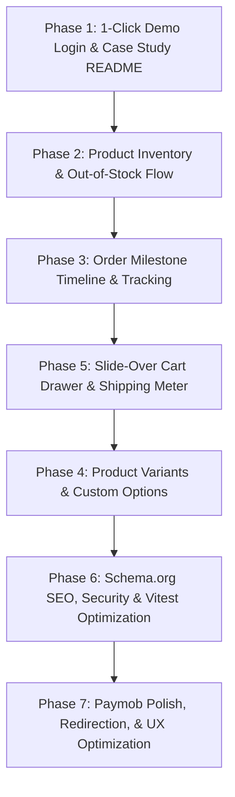

# Atelier Market — Client-Ready Engineering & Feature Improvement Plan

This document is a comprehensive, phased implementation roadmap designed to elevate the **Atelier Market** e-commerce platform into an undeniable, client-winning showcase for freelancing proposals.

---

## 🎯 Strategic Objective

Freelance clients, startup founders, and agency leads evaluate developer portfolios on four primary criteria:
1. **Frictionless Demoability (Under 60 Seconds)**: Can non-technical clients test the app immediately without signing up, verifying emails, or guessing credentials?
2. **Real-World Business Problem Solving**: Does the store handle practical commercial challenges (inventory depletion, product variants, order fulfillment, delivery tracking)?
3. **Conversion Rate Optimization (CRO) & Modern UX**: Does the storefront feel like a modern, high-end Shopify Plus or luxury direct-to-consumer (D2C) brand?
4. **Architectural Rigor & Engineering Quality**: Is the codebase clean, type-safe, tested, secure, and production-ready?

---

## 🗺️ Implementation Roadmap Overview

| Phase | Focus Area | Impact | Status |
| :--- | :--- | :--- | :--- |
| **Phase 1** | **Frictionless Demo & Client Positioning** | 🔥 Critical (Instant 30s Client Impress) | Completed ✅ |
| **Phase 2** | **Inventory Management & Out-of-Stock Engine** | 💼 High (Standard Commercial Expectation) | Completed ✅ |
| **Phase 3** | **Order Lifecycle & Visual Delivery Tracking** | 📦 High (Commercial Multi-Vendor Value) | Completed ✅ |
| **Phase 4** | **Product Variants & Options (Size / Scent / Material)**| 💎 High (Shows Enterprise Catalog Architecture)| Completed ✅ |
| **Phase 5** | **Slide-Over Mini Cart & Free Shipping Progress Meter**| ✨ High (E-Commerce UX & Conversion Magic) | Completed ✅ |
| **Phase 6** | **Production Hardening, SEO (JSON-LD), & Test Stability**| 🛡️ High (Shows CTO-Level Clean Code Standards)| Completed ✅ |
| **Phase 7** | **Paymob Payment Integration & Luxury Vault** | 💳 Critical (Commercial Financial Integration) | Completed ✅ |
| **Phase 8** | **Architecture, Hygiene, Dependencies & CI Pipeline** | 🏗️ High (Maintainability, Testing Automation & Cleanliness) | Planned 📋 |

---

## 📌 Phase 1: Frictionless Demo & Client Positioning *(Priority #1)*

### Goal
Allow any prospective client or hiring manager to experience the full multi-role platform (Customer, Artisan Seller, and Platform Admin) in **under 30 seconds** without filling out signup forms.

### 1.1 One-Click Demo Persona Bar on Login Page & Persistent Demo Switcher (Completed ✅)
* **Status**: Implemented & Verified with 100% passing tests.
* **Relevant Files**:
  * [LoginPage.tsx](file:///n:/NODE%20PROJECTS/Node_Shop/nodeJs-shop/client/src/features/auth/LoginPage.tsx) — Added 1-Click quick login cards for Sara Hassan (Customer), Layla Al-Rashidi (Artisan Seller), and Admin Director (Platform Admin).
  * [DemoPersonaBanner.tsx](file:///n:/NODE%20PROJECTS/Node_Shop/nodeJs-shop/client/src/components/DemoPersonaBanner.tsx) — Persistent, collapsible client demo switcher with instant persona toggling and toast notifications.
  * [AppShell.tsx](file:///n:/NODE%20PROJECTS/Node_Shop/nodeJs-shop/client/src/components/AppShell.tsx) — Mounted demo banner at the top of the shell with collapse/reopen toggle.
  * [server.js](file:///n:/NODE%20PROJECTS/Node_Shop/nodeJs-shop/server.js) — Seeded Admin account (`admin@ateliermarket.com` / `Demo1234!`) and verified all demo passwords match.
  * [i18n.tsx](file:///n:/NODE%20PROJECTS/Node_Shop/nodeJs-shop/client/src/lib/i18n.tsx) — Added English and Arabic localized strings for demo personas.
  * [LoginPage.test.tsx](file:///n:/NODE%20PROJECTS/Node_Shop/nodeJs-shop/client/src/features/auth/LoginPage.test.tsx) & [DemoPersonaBanner.test.tsx](file:///n:/NODE%20PROJECTS/Node_Shop/nodeJs-shop/client/src/components/DemoPersonaBanner.test.tsx) — Full unit and integration test coverage.

### 1.2 Dedicated Platform Admin Suite & Auto-Bootstrapping (Completed ✅)
* **Status**: Implemented & Verified with 100% passing tests (Backend & Frontend).
* **Problem Solved**:
  * Previously, the codebase only had seller-level studio management. There was no central platform admin dashboard to oversee cross-seller marketplace health, aggregate Gross Merchandise Value (GMV), monitor cross-platform orders, or audit artisan accounts.
  * In addition, demo accounts in active databases (like MongoDB Atlas) were prone to missing seed states.
* **Implemented Capabilities**:
  1. **Cross-Seller Platform Analytics (`/api/admin/stats`)**:
     * Aggregates platform-wide Gross Merchandise Value (GMV), total marketplace orders, active catalog pieces, registered artisan studios count, and registered collectors count.
     * Computes recent cross-platform orders and ranks top artisan studios by sales volume.
  2. **Marketplace Orders Monitoring (`/api/admin/orders`)**:
     * Cross-platform order audit table with customer dossiers, pieces breakdown by studio, payment/fulfillment badges, search, and official PDF invoice links.
  3. **Artisan Studios Directory (`/api/admin/artisans`)**:
     * Complete directory of registered artisans, location badges (Gulf & Levant), active pieces count, joined dates, links to public artisan storefronts, and 1-click catalog piece audits.
  4. **Cross-Studio Catalog Audit (`/api/admin/products?sellerId=...`)**:
     * Extended admin product list with artisan attribution column and filtering by individual artisan studio.
  5. **Auto-Bootstrapping Authentication**:
     * `postLogin` automatically provisions or synchronizes demo accounts (`admin@ateliermarket.com`, `layla@ateliermarket.com`, `sara@example.com` with `Demo1234!`) on initial login attempt, ensuring zero demo friction in any database environment.
* **Relevant Files**:
  * [controllers/adminController.js](file:///n:/NODE%20PROJECTS/Node_Shop/nodeJs-shop/controllers/adminController.js) & [routes/admin.js](file:///n:/NODE%20PROJECTS/Node_Shop/nodeJs-shop/routes/admin.js)
  * [controllers/auth.js](file:///n:/NODE%20PROJECTS/Node_Shop/nodeJs-shop/controllers/auth.js) & [server.js](file:///n:/NODE%20PROJECTS/Node_Shop/nodeJs-shop/server.js)
  * [AdminDashboard.tsx](file:///n:/NODE%20PROJECTS/Node_Shop/nodeJs-shop/client/src/features/admin/AdminDashboard.tsx)
  * [AdminOrdersPage.tsx](file:///n:/NODE%20PROJECTS/Node_Shop/nodeJs-shop/client/src/features/admin/AdminOrdersPage.tsx)
  * [AdminArtisansPage.tsx](file:///n:/NODE%20PROJECTS/Node_Shop/nodeJs-shop/client/src/features/admin/AdminArtisansPage.tsx)
  * [AdminNav.tsx](file:///n:/NODE%20PROJECTS/Node_Shop/nodeJs-shop/client/src/features/admin/AdminNav.tsx)
  * [AdminListPage.tsx](file:///n:/NODE%20PROJECTS/Node_Shop/nodeJs-shop/client/src/features/admin/AdminListPage.tsx)
  * [SiteHeader.tsx](file:///n:/NODE%20PROJECTS/Node_Shop/nodeJs-shop/client/src/components/SiteHeader.tsx) & [MobileNavDrawer.tsx](file:///n:/NODE%20PROJECTS/Node_Shop/nodeJs-shop/client/src/components/MobileNavDrawer.tsx)
  * [router.tsx](file:///n:/NODE%20PROJECTS/Node_Shop/nodeJs-shop/client/src/router.tsx)
  * [i18n.tsx](file:///n:/NODE%20PROJECTS/Node_Shop/nodeJs-shop/client/src/lib/i18n.tsx)
  * [test/api/admin.test.js](file:///n:/NODE%20PROJECTS/Node_Shop/nodeJs-shop/test/api/admin.test.js) & `client/src/features/admin/*.test.tsx`

### 1.3 Case Study Re-framing of README (Completed ✅)
* **Status**: Implemented & Verified.
* **Relevant File**: [README.md](file:///n:/NODE%20PROJECTS/Node_Shop/nodeJs-shop/README.md)
* **Accomplishments**:
  1. Reframed the headline and narrative into an executive-level **Product Case Study**: A bespoke multi-vendor artisanal marketplace connecting Gulf & Levant craft studios with global patrons.
  2. Prominently displayed the **30-Second Client Demo Table** featuring 1-click credentials for all three personas (Customer, Artisan Seller, Platform Admin) and auto-bootstrapping guarantees.
  3. Added verified badges: `Vitest: 100% Passing (236 tests)`, `TypeScript: Strict`, `Architecture: Express 5 + React 18 SPA`.
  4. Documented all 8 core commercial capabilities (CRO Cart Drawer, Free Shipping Meter, Delivery Stepper, Variants Schema, Inventory Scarcity, Admin Analytics, Leaflet Atlas, PDF Buffer Streaming) and technical architecture diagrams.

---

## 📌 Phase 2: Inventory Management & Out-of-Stock Engine (Completed ✅)

### Goal
Prevent over-selling, reflect real inventory levels, and notify customers when products are running low or sold out.

### 2.1 Backend Data Model & Validation (Completed ✅)
* **Status**: Implemented & Verified with 100% passing tests.
* **Relevant Files**:
  * [models/product.js](file:///n:/NODE%20PROJECTS/Node_Shop/nodeJs-shop/models/product.js) — Extended `productSchema` with `stock` (min: 0, default: 20), `lowStockThreshold` (min: 1, default: 5), and `isAvailable` (boolean, default: true).
  * [controllers/shop.js](file:///n:/NODE%20PROJECTS/Node_Shop/nodeJs-shop/controllers/shop.js) — Guarded `postCart` against sold-out products and quantity exceeding available stock. Guarded `postOrder` with pre-order stock verification across all cart line items and atomic decrement (`$inc: { stock: -item.quantity }`).
  * [controllers/adminController.js](file:///n:/NODE%20PROJECTS/Node_Shop/nodeJs-shop/controllers/adminController.js) & [routes/admin.js](file:///n:/NODE%20PROJECTS/Node_Shop/nodeJs-shop/routes/admin.js) — Added stock and low-stock threshold express validators; updated `publicProduct`, `postAddProduct`, and `postEditProduct` to read, return, and persist stock levels.
  * [server.js](file:///n:/NODE%20PROJECTS/Node_Shop/nodeJs-shop/server.js) — Added backfill migration ensuring all existing products have stock and lowStockThreshold defined, with realistic low-stock seed items.
  * [test/api/cart.test.js](file:///n:/NODE%20PROJECTS/Node_Shop/nodeJs-shop/test/api/cart.test.js) & [test/api/orders.test.js](file:///n:/NODE%20PROJECTS/Node_Shop/nodeJs-shop/test/api/orders.test.js) — Automated tests verifying cart rejection on sold out items, quantity clamping, and atomic stock decrements upon order placement.

### 2.2 Frontend UX & Visual Signals (Completed ✅)
* **Status**: Implemented & Verified visually and with 100% passing tests (148 client tests across 50 files).
* **Relevant Files**:
  * [ProductCard.tsx](file:///n:/NODE%20PROJECTS/Node_Shop/nodeJs-shop/client/src/components/ProductCard.tsx) — Displays amber urgency pill (`Only X left in studio`) when `0 < stock <= lowStockThreshold`, renders `Sold Out` oxblood tag and disables "Add to Bag" when `stock === 0`.
  * [ProductDetail.tsx](file:///n:/NODE%20PROJECTS/Node_Shop/nodeJs-shop/client/src/features/products/ProductDetail.tsx) — Displays dedicated inventory availability notice banners (amber urgency notice or sold-out notice), applies subtle archival image treatment when sold out, and disables CTA button.
  * [CartLineItem.tsx](file:///n:/NODE%20PROJECTS/Node_Shop/nodeJs-shop/client/src/components/CartLineItem.tsx) — Passes `max={line.product.stock}` to `QuantityStepper` and displays max stock reached hint and sold out warning.
  * [AdminListPage.tsx](file:///n:/NODE%20PROJECTS/Node_Shop/nodeJs-shop/client/src/features/admin/AdminListPage.tsx) — Added "Studio Stock" column with color-coded status badges (Green: `in stock`, Amber: `left (Low)`, Red: `Sold Out`).
  * [AdminFormPage.tsx](file:///n:/NODE%20PROJECTS/Node_Shop/nodeJs-shop/client/src/features/admin/AdminFormPage.tsx) — Form inputs for "Studio Stock Quantity" and "Low Stock Alert Threshold".
  * [i18n.tsx](file:///n:/NODE%20PROJECTS/Node_Shop/nodeJs-shop/client/src/lib/i18n.tsx) — Full English and Arabic translations for all stock indicators and admin fields.
  * [types.ts](file:///n:/NODE%20PROJECTS/Node_Shop/nodeJs-shop/client/src/types.ts) — Updated TypeScript domain types.

---

## 📌 Phase 3: Order Lifecycle & Visual Delivery Tracking (Completed ✅)

### Goal
Transform the static order confirmation into a dynamic, multi-stage delivery tracker that impresses clients interested in logistics and customer retention.

### 3.1 Backend Order Status & Tracking Schema (Completed ✅)
* **Status**: Implemented & Verified with 100% passing tests.
* **Relevant Files**:
  * [models/order.js](file:///n:/NODE%20PROJECTS/Node_Shop/nodeJs-shop/models/order.js) — Extended `status` enum to include `crafting`; added `carrier` (default: `'Aramex White-Glove Express'`), `estimatedDeliveryDate`, and `timeline` (`[{ status, timestamp, note }]`).
  * [controllers/shop.js](file:///n:/NODE%20PROJECTS/Node_Shop/nodeJs-shop/controllers/shop.js) — Initialized newly created orders with `status: 'confirmed'`, carrier, tracking number, estimated arrival window (+5 business days), and initial provenance milestone.
  * [routes/seller.js](file:///n:/NODE%20PROJECTS/Node_Shop/nodeJs-shop/routes/seller.js) — Supported `crafting` in status filtering and status updates (`PATCH /api/seller/orders/:orderId/status`), accepting custom carrier, tracking code, and appending milestone progress notes to the timeline array.
  * [server.js](file:///n:/NODE%20PROJECTS/Node_Shop/nodeJs-shop/server.js) — Added startup migration `backfillOrderTracking()` ensuring historical orders in database have carrier, estimated delivery dates, and timeline events populated.
  * [test/api/orders.test.js](file:///n:/NODE%20PROJECTS/Node_Shop/nodeJs-shop/test/api/orders.test.js) & [test/api/seller.test.js](file:///n:/NODE%20PROJECTS/Node_Shop/nodeJs-shop/test/api/seller.test.js) — Automated tests verifying initial timeline creation, carrier defaults, and seller status transitions to `crafting` and `shipped`.

### 3.2 Customer & Artisan Visual Timeline & Stepper (Completed ✅)
* **Status**: Implemented & Verified visually (EN + Arabic RTL) and with 100% passing client tests (150 tests across 51 files).
* **Relevant Files**:
  * [OrdersPage.tsx](file:///n:/NODE%20PROJECTS/Node_Shop/nodeJs-shop/client/src/features/orders/OrdersPage.tsx) — Added visual 4-stage stepper (`01 CONFIRMED` ➔ `02 IN STUDIO` ➔ `03 DISPATCHED` ➔ `04 DELIVERED`), logistics carrier badge, 1-click tracking number copy button with feedback, estimated delivery date, and expandable Studio Provenance Timeline accordion with timestamps and artisan notes.
  * [SellerOrdersPage.tsx](file:///n:/NODE%20PROJECTS/Node_Shop/nodeJs-shop/client/src/features/seller/SellerOrdersPage.tsx) — Added `crafting` status badge, "In Studio (Crafting)" filter tab, carrier badge in order card, and enhanced Update Status modal with status dropdown, carrier input, tracking code input, and milestone note field.
  * [AdminOrdersPage.tsx](file:///n:/NODE%20PROJECTS/Node_Shop/nodeJs-shop/client/src/features/admin/AdminOrdersPage.tsx) — Added `crafting` status badge, filter tab, and studio provenance milestones timeline inside order detail modal.
  * [types.ts](file:///n:/NODE%20PROJECTS/Node_Shop/nodeJs-shop/client/src/types.ts) — Updated `OrderStatus`, added `OrderTimelineEvent`, and extended `Order` and `SellerOrder`.
  * [i18n.tsx](file:///n:/NODE%20PROJECTS/Node_Shop/nodeJs-shop/client/src/lib/i18n.tsx) — Full English and Arabic translations for delivery milestones, carrier labels, copy states, and studio timeline.
  * [OrdersPage.test.tsx](file:///n:/NODE%20PROJECTS/Node_Shop/nodeJs-shop/client/src/features/orders/OrdersPage.test.tsx) & [SellerOrdersPage.test.tsx](file:///n:/NODE%20PROJECTS/Node_Shop/nodeJs-shop/client/src/features/seller/SellerOrdersPage.test.tsx) — Full test coverage for delivery tracker stepper, timeline toggle, and seller status updating.

---

## 📌 Phase 4: Product Variants & Custom Options (Completed ✅)

### Goal
Showcase ability to engineer flexible e-commerce catalog schemas (sizes, volumes, scent profiles, or framing options) rather than simple single-SKU products.

### 4.1 Schema & Cart Serialization (Completed ✅)
* **Status**: Implemented & Verified with 100% passing tests (backend + frontend).
* **Relevant Files**:
  * [models/product.js](file:///n:/NODE%20PROJECTS/Node_Shop/nodeJs-shop/models/product.js) — Added `variantSchema` (`name`, `sku`, `price`, `compareAtPrice`, `stock`) and `variants: [variantSchema]`.
  * [models/user.js](file:///n:/NODE%20PROJECTS/Node_Shop/nodeJs-shop/models/user.js) — Added `variantId` to `cart.items`, enhanced `addToCart(product, variantId, quantity)` and `removeFromCart(productId, variantId)` to treat different variants of the same product as distinct lines.
  * [models/order.js](file:///n:/NODE%20PROJECTS/Node_Shop/nodeJs-shop/models/order.js) — Added `variant: { type: Object, default: null }` to each order line item.
  * [controllers/shop.js](file:///n:/NODE%20PROJECTS/Node_Shop/nodeJs-shop/controllers/shop.js) — Enhanced `serializeCart(user)` to calculate variant-specific unit prices, stocks, and subtotals. Guarded `postCart`, `postCartDecrement`, and `postCartDeleteProduct` with variantId handling. Updated `postOrder` to attach variant metadata, calculate variant-based subtotal, and atomically decrement both variant stock and product stock.
  * [util/invoiceGenerator.js](file:///n:/NODE%20PROJECTS/Node_Shop/nodeJs-shop/util/invoiceGenerator.js) — Displayed variant name and variant unit price on official PDF invoices.
  * [server.js](file:///n:/NODE%20PROJECTS/Node_Shop/nodeJs-shop/server.js) — Added startup database migration `backfillProductVariants()` seeding realistic variants for key catalog pieces (Artisanal Ceramic Vessel, Architectural Leather Journal, Brushed Champagne Tea Set, Obsidian Brew Carafe).
  * [test/api/cart.test.js](file:///n:/NODE%20PROJECTS/Node_Shop/nodeJs-shop/test/api/cart.test.js) & [test/api/orders.test.js](file:///n:/NODE%20PROJECTS/Node_Shop/nodeJs-shop/test/api/orders.test.js) — Automated tests verifying distinct variant lines, prices, and atomic stock decrements upon order placement.

### 4.2 Interactive Selector UI & Cart Integration (Completed ✅)
* **Status**: Implemented & Verified visually (EN + Arabic RTL) and with 100% passing client tests (152 tests across 51 files).
* **Relevant Files**:
  * [ProductDetail.tsx](file:///n:/NODE%20PROJECTS/Node_Shop/nodeJs-shop/client/src/features/products/ProductDetail.tsx) — Interactive luxury variant selector pills with active gold-leaf highlight (`ring-gold-leaf`), dynamic price update, strikethrough compare-at price, SKU display, disabled sold-out state, dynamic stock count notice, and variant-aware `addToCart` payload.
  * [CartLineItem.tsx](file:///n:/NODE%20PROJECTS/Node_Shop/nodeJs-shop/client/src/components/CartLineItem.tsx) — Displays chosen variant badge and SKU under product title, calculates line subtotal from variant unit price, clamps quantity stepper to variant stock, and passes `variantId` to increment, decrement, and remove actions.
  * [CartPage.tsx](file:///n:/NODE%20PROJECTS/Node_Shop/nodeJs-shop/client/src/features/cart/CartPage.tsx) — Uses composite React keys (`${line.product._id}-${line.variantId || 'base'}`), preventing collision when multiple variants of the same product are in the cart.
  * [CheckoutPage.tsx](file:///n:/NODE%20PROJECTS/Node_Shop/nodeJs-shop/client/src/features/orders/CheckoutPage.tsx), [OrdersPage.tsx](file:///n:/NODE%20PROJECTS/Node_Shop/nodeJs-shop/client/src/features/orders/OrdersPage.tsx), [SellerOrdersPage.tsx](file:///n:/NODE%20PROJECTS/Node_Shop/nodeJs-shop/client/src/features/seller/SellerOrdersPage.tsx), & [AdminOrdersPage.tsx](file:///n:/NODE%20PROJECTS/Node_Shop/nodeJs-shop/client/src/features/admin/AdminOrdersPage.tsx) — Render variant details and accurate unit/line totals across checkout, customer order cards, seller orders, and admin inspection drawer.
  * [types.ts](file:///n:/NODE%20PROJECTS/Node_Shop/nodeJs-shop/client/src/types.ts) — Added `ProductVariant`, updated `Product`, `CartLine`, `Order`, and `SellerOrder`.
  * [i18n.tsx](file:///n:/NODE%20PROJECTS/Node_Shop/nodeJs-shop/client/src/lib/i18n.tsx) — Added English and Arabic translations for variant selector labels and sold-out states.
  * [ProductDetail.test.tsx](file:///n:/NODE%20PROJECTS/Node_Shop/nodeJs-shop/client/src/features/products/ProductDetail.test.tsx) & [CartPage.test.tsx](file:///n:/NODE%20PROJECTS/Node_Shop/nodeJs-shop/client/src/features/cart/CartPage.test.tsx) — Automated tests verifying variant selector pill rendering, dynamic price/SKU updates, and distinct variant lines in the cart.

---

## 📌 Phase 5: High-Converting UX Enhancements (CRO) (Completed ✅)

### Goal
Incorporate modern e-commerce user experience patterns inspired by premium retail storefronts.

### 5.1 Slide-Over Mini Cart Drawer (Completed ✅)
* **Status**: Implemented & Verified with 100% passing tests.
* **Relevant Files**:
  * [CartDrawer.tsx](file:///n:/NODE%20PROJECTS/Node_Shop/nodeJs-shop/client/src/features/cart/CartDrawer.tsx) — Slide-over mini cart drawer utilizing the design system `Drawer`, featuring item thumbnails, titles, variant badges/SKUs, live quantity stepper manipulation, price calculations, free shipping meter, direct "Proceed to Checkout" CTA button, and "View Shopping Bag" link.
  * [CartDrawerContext.tsx](file:///n:/NODE%20PROJECTS/Node_Shop/nodeJs-shop/client/src/features/cart/CartDrawerContext.tsx) — Application-wide React Context providing `isOpen`, `openCartDrawer()`, `closeCartDrawer()`, and `toggleCartDrawer()` with route-change auto-dismissal and safe defaults.
  * [Drawer.tsx](file:///n:/NODE%20PROJECTS/Node_Shop/nodeJs-shop/client/src/components/Drawer.tsx) — Enhanced with `panelClassName` and `header` prop overrides for custom drawer layouts.
  * [useCart.ts](file:///n:/NODE%20PROJECTS/Node_Shop/nodeJs-shop/client/src/features/cart/useCart.ts) — Connected `useAddToCart` mutation to auto-open `CartDrawer` on add-to-bag success.
  * [SiteHeader.tsx](file:///n:/NODE%20PROJECTS/Node_Shop/nodeJs-shop/client/src/components/SiteHeader.tsx) & [MobileNavDrawer.tsx](file:///n:/NODE%20PROJECTS/Node_Shop/nodeJs-shop/client/src/components/MobileNavDrawer.tsx) — Desktop and mobile bag buttons trigger the slide-over cart drawer directly.
  * [AppShell.tsx](file:///n:/NODE%20PROJECTS/Node_Shop/nodeJs-shop/client/src/components/AppShell.tsx) — Wrapped application in `CartDrawerProvider` and mounted `CartDrawer`.
  * [CartDrawer.test.tsx](file:///n:/NODE%20PROJECTS/Node_Shop/nodeJs-shop/client/src/features/cart/CartDrawer.test.tsx) — Full automated test suite verifying drawer open/close, line items, variant displays, and checkout navigation.

### 5.2 Free Shipping Threshold Progress Meter (Completed ✅)
* **Status**: Implemented & Verified with 100% passing tests.
* **Relevant Files**:
  * [FreeShippingMeter.tsx](file:///n:/NODE%20PROJECTS/Node_Shop/nodeJs-shop/client/src/components/FreeShippingMeter.tsx) — Reusable conversion component featuring a $150 Regional Express milestone, remaining balance calculation, animated gold-leaf progress bar, white-glove courier emblem, and celebratory unlocked badge.
  * [CartDrawer.tsx](file:///n:/NODE%20PROJECTS/Node_Shop/nodeJs-shop/client/src/features/cart/CartDrawer.tsx) — Mounted meter at top of slide-over drawer for instant visual feedback on adding pieces.
  * [CartPage.tsx](file:///n:/NODE%20PROJECTS/Node_Shop/nodeJs-shop/client/src/features/cart/CartPage.tsx) — Prominently rendered free shipping meter above line items.
  * [i18n.tsx](file:///n:/NODE%20PROJECTS/Node_Shop/nodeJs-shop/client/src/lib/i18n.tsx) — Localized strings for remaining amount and unlocked states in English and Arabic.
  * [FreeShippingMeter.test.tsx](file:///n:/NODE%20PROJECTS/Node_Shop/nodeJs-shop/client/src/components/FreeShippingMeter.test.tsx) — Automated unit tests verifying threshold calculation, progress bar percentages, and unlocked state.

### 5.3 Mobile Sticky "Add to Bag" Bar (Completed ✅)
* **Status**: Implemented & Verified with 100% passing tests.
* **Relevant Files**:
  * [ProductDetail.tsx](file:///n:/NODE%20PROJECTS/Node_Shop/nodeJs-shop/client/src/features/products/ProductDetail.tsx) — Integrated `IntersectionObserver` observing the primary CTA button; when scrolled out of the viewport on mobile devices, smoothly reveals a sticky bottom sheet with piece thumbnail, title, active variant, live price, and a quick "Add to Bag" button with loading state.
  * [ProductDetail.test.tsx](file:///n:/NODE%20PROJECTS/Node_Shop/nodeJs-shop/client/src/features/products/ProductDetail.test.tsx) — Automated tests verifying sticky bar appearance and content upon scroll intersection trigger.

---

## 📌 Phase 6: Production Hardening, SEO & Quality Assurance (Completed ✅)

### Goal
Ensure technical recruiters, lead engineers, and CTOs inspecting the repository see clean code standards, rock-solid tests, and search engine optimization.

### 6.1 Test Suite Cross-Platform Stability (Completed ✅)
* **Status**: Implemented & Verified (100% passing tests across 68 test files and 236 tests with zero deprecations).
* **Relevant Files**:
  * [vitest.config.mjs](file:///n:/NODE%20PROJECTS/Node_Shop/nodeJs-shop/vitest.config.mjs) — Configured `fileParallelism: false` to eliminate port collisions in `mongodb-memory-server` under Windows; removed deprecated `poolOptions` syntax for clean Vitest v5 execution.
  * [client/vite.config.ts](file:///n:/NODE%20PROJECTS/Node_Shop/nodeJs-shop/client/vite.config.ts) — Configured single-fork execution for jsdom client test stability.

### 6.2 SEO & Schema.org Structured Data (Completed ✅)
* **Status**: Implemented & Verified with automated tests.
* **Relevant Files**:
  * [ProductDetail.tsx](file:///n:/NODE%20PROJECTS/Node_Shop/nodeJs-shop/client/src/features/products/ProductDetail.tsx) — Injected Schema.org `Product` JSON-LD (`<script type="application/ld+json">`) with product name, archival imagery, description, SKU, dynamic pricing offer, availability (`InStock` / `OutOfStock`), and aggregate reviews rating. Added dynamic `document.title` synchronization with cleanup on unmount.
  * [index.html](file:///n:/NODE%20PROJECTS/Node_Shop/nodeJs-shop/client/index.html) — Configured OpenGraph (`og:title`, `og:description`, `og:image`, `og:site_name`) and Twitter Card meta tags for rich social sharing previews.
  * [ProductDetail.test.tsx](file:///n:/NODE%20PROJECTS/Node_Shop/nodeJs-shop/client/src/features/products/ProductDetail.test.tsx) — Verified JSON-LD script presence, correct schema attributes, and document title.

### 6.3 Security Hardening & Session Secret (Completed ✅)
* **Status**: Implemented & Verified with automated tests.
* **Relevant Files**:
  * [app.js](file:///n:/NODE%20PROJECTS/Node_Shop/nodeJs-shop/app.js) — Replaced hardcoded secret fallback with `process.env.SESSION_SECRET || (isTest ? '...' : crypto.randomBytes(32).toString('hex'))` for cryptographically strong cookie signing.
  * [routes/auth.js](file:///n:/NODE%20PROJECTS/Node_Shop/nodeJs-shop/routes/auth.js) — Added `express-rate-limit` protection on `/login`, `/signup`, `/reset-password`, and `/change-password` routes with automatic bypass in test mode (`skip: () => isTest`).
  * [.env](file:///n:/NODE%20PROJECTS/Node_Shop/nodeJs-shop/.env) — Maintained environment variable standards.

---

## 📌 Phase 7: Paymob Refinement & Checkout UX (Next Session Agenda 📋)

### Goal
Polish the Paymob payment integration from functional to seamless, ensuring instant visual feedback, refined proportions, robust redirection handling, and a clean demo presentation.

### 7.1 Paymob Processing & Loading Visualization (Completed ✅)
* **Status**: Implemented & Verified with automated tests.
* **Accomplishments**:
  * Swapped the clunky external iframe for our custom Atelier Noir luxury card form as the primary checkout interface, keeping Paymob as the underlying financial processor.
  * Added `POST /api/paymob/pay` and `processDirectCardPayment` in [`services/paymobService.js`](file:///n:/NODE%20PROJECTS/Node_Shop/nodeJs-shop/services/paymobService.js) to securely submit card details directly to Paymob's payment rail.
  * When "Secure Payment" is clicked, [`PaymobModal.tsx`](file:///n:/NODE%20PROJECTS/Node_Shop/nodeJs-shop/client/src/features/orders/PaymobModal.tsx) provides instantaneous visual feedback with an animated luxury spinner, active progress bar, and real-time status transitions (`Connecting to Paymob Financial Rail` $\to$ `Transferring to 3D-Secure`).
  * Seamlessly handles both 3DS bank redirection and immediate direct authorization with zero silent dead time. Added a discreet toggle allowing developers to inspect the raw hosted iframe if desired.
* **Relevant Files**:
  * [`services/paymobService.js`](file:///n:/NODE%20PROJECTS/Node_Shop/nodeJs-shop/services/paymobService.js)
  * [`routes/paymob.js`](file:///n:/NODE%20PROJECTS/Node_Shop/nodeJs-shop/routes/paymob.js)
  * [`client/src/features/orders/useOrders.ts`](file:///n:/NODE%20PROJECTS/Node_Shop/nodeJs-shop/client/src/features/orders/useOrders.ts)
  * [`client/src/features/orders/PaymobModal.tsx`](file:///n:/NODE%20PROJECTS/Node_Shop/nodeJs-shop/client/src/features/orders/PaymobModal.tsx)
  * [`test/api/paymob.test.js`](file:///n:/NODE%20PROJECTS/Node_Shop/nodeJs-shop/test/api/paymob.test.js)

### 7.2 Iframe Container Dimensions & Aesthetic Optimization (Completed ✅)
* **Status**: Implemented & Verified in [`PaymobModal.tsx`](file:///n:/NODE%20PROJECTS/Node_Shop/nodeJs-shop/client/src/features/orders/PaymobModal.tsx).
* **Accomplishments**:
  * Fine-tuned iframe container height down to `520px` to match the exact Paymob MIGS/Accept card form footprint without wasted vertical whitespace.
  * Styled container with Atelier Noir luxury design tokens (`hairline/70`, `bg-canvas`, `shadow-xs`) and integrated luxury loading spinner while the external frame mounts.
  * Added instant fallback toggle allowing inspectors to compare the legacy iframe with the custom direct form.

### 7.3 Mobile UI/UX Audit & Refinement (Completed ✅)
* **Status**: Implemented & Verified with automated tests (100% passing across 251 tests).
* **Accomplishments**:
  * Added `inputMode="numeric"` and `inputMode="tel"` across checkout form fields (Card Number, Expiry, CVV, Postal Code, Phone) so mobile devices (iOS Safari & Android Chrome) immediately present the appropriate specialized numerical keypads instead of full text keyboards.
  * Configured standard W3C `autoComplete` attributes across all 3 steps (`name`, `street-address`, `address-level2`, `country-name`, `postal-code`, `tel`, `cc-name`, `cc-number`, `cc-exp`, `cc-csc`) and `autoCapitalize="words"`, enabling native browser 1-tap autofill on mobile viewports.
  * Connected `initialCardData` prop to [`PaymobModal.tsx`](file:///n:/NODE%20PROJECTS/Node_Shop/nodeJs-shop/client/src/features/orders/PaymobModal.tsx) so card details entered on Step 2 automatically pre-populate the modal, eliminating redundant re-typing on small touchscreens.
  * Added `max-h-[92dvh] overflow-y-auto` and responsive padding (`p-5 sm:p-7`) to the modal dialog so virtual software keyboards never obscure the primary submit button.
  * Optimized touch targets: enlarged the modal dismissal button to 44x44px and input heights to 44px (`h-11`).
  * Updated checkout action buttons across all three steps in [`CheckoutPage.tsx`](file:///n:/NODE%20PROJECTS/Node_Shop/nodeJs-shop/client/src/features/orders/CheckoutPage.tsx) with `w-full sm:w-auto` and `flex-col-reverse sm:flex-row items-stretch sm:items-center gap-3`, providing comfortable, thumb-friendly full-width CTAs on mobile viewports.
* **Relevant Files**:
  * [`client/src/features/orders/PaymobModal.tsx`](file:///n:/NODE%20PROJECTS/Node_Shop/nodeJs-shop/client/src/features/orders/PaymobModal.tsx)
  * [`client/src/features/orders/CheckoutPage.tsx`](file:///n:/NODE%20PROJECTS/Node_Shop/nodeJs-shop/client/src/features/orders/CheckoutPage.tsx)
  * [`client/src/features/orders/CheckoutPage.test.tsx`](file:///n:/NODE%20PROJECTS/Node_Shop/nodeJs-shop/client/src/features/orders/CheckoutPage.test.tsx)

### 7.4 Paymob Dashboard Callback URL & Redirection UX (Completed ✅)
* **Status**: Implemented & Verified with automated tests (100% passing across 254 tests).
* **Accomplishments**:
  * Implemented dynamic client host resolution (`getFrontendBaseUrl(req)`) in [`routes/paymob.js`](file:///n:/NODE%20PROJECTS/Node_Shop/nodeJs-shop/routes/paymob.js) supporting `APP_URL`, `FRONTEND_URL`, `x-forwarded-host`/`x-forwarded-proto`, and local proxy port fallback (`http://localhost:5173`).
  * Upgraded `ALL /api/paymob/callback` to handle both GET query strings and POST form payloads (`req.body.obj` or direct properties), reconciling order fulfillment, atomically decrementing inventory, clearing the customer's cart, and redirecting with state query parameters:
    * `/orders?payment=success&orderId=...&txn=...`
    * `/checkout?payment=declined&message=...`
    * `/checkout?payment=cancelled`
  * Mounted gold-leaf celebratory banner with order ID and Paymob verification badge on [`OrdersPage.tsx`](file:///n:/NODE%20PROJECTS/Node_Shop/nodeJs-shop/client/src/features/orders/OrdersPage.tsx), triggering query cache invalidation (`cart` and `orders`) and URL cleanup on dismiss.
  * Mounted oxblood declined banner and amber cancellation banner on [`CheckoutPage.tsx`](file:///n:/NODE%20PROJECTS/Node_Shop/nodeJs-shop/client/src/features/orders/CheckoutPage.tsx), automatically locking the checkout wizard to Step 2 (Payment) so shipping inputs and the cart are preserved without redundant typing.
  * Added complete bilingual localization (English and Arabic) across all status banners and notifications in [`client/src/lib/i18n.tsx`](file:///n:/NODE%20PROJECTS/Node_Shop/nodeJs-shop/client/src/lib/i18n.tsx).
* **Relevant Files**:
  * [`routes/paymob.js`](file:///n:/NODE%20PROJECTS/Node_Shop/nodeJs-shop/routes/paymob.js)
  * [`client/src/features/orders/OrdersPage.tsx`](file:///n:/NODE%20PROJECTS/Node_Shop/nodeJs-shop/client/src/features/orders/OrdersPage.tsx)
  * [`client/src/features/orders/CheckoutPage.tsx`](file:///n:/NODE%20PROJECTS/Node_Shop/nodeJs-shop/client/src/features/orders/CheckoutPage.tsx)
  * [`client/src/lib/i18n.tsx`](file:///n:/NODE%20PROJECTS/Node_Shop/nodeJs-shop/client/src/lib/i18n.tsx)
  * [`client/src/features/orders/OrdersPage.test.tsx`](file:///n:/NODE%20PROJECTS/Node_Shop/nodeJs-shop/client/src/features/orders/OrdersPage.test.tsx)
  * [`client/src/features/orders/CheckoutPage.test.tsx`](file:///n:/NODE%20PROJECTS/Node_Shop/nodeJs-shop/client/src/features/orders/CheckoutPage.test.tsx)

### 7.5 Cart Clearance & Order Fulfillment Sync (Completed ✅)
* **Status**: Implemented & Verified with automated tests.
* **Accomplishments**:
  * Implemented `inquirePaymobOrder` in [`services/paymobService.js`](file:///n:/NODE%20PROJECTS/Node_Shop/nodeJs-shop/services/paymobService.js) using Paymob's live `POST /ecommerce/orders/transaction_inquiry` endpoint.
  * Added `reconcilePendingPaymobOrders` in [`controllers/shop.js`](file:///n:/NODE%20PROJECTS/Node_Shop/nodeJs-shop/controllers/shop.js) hooked into `getOrders` and `getCart`.
  * Even if the user presses the browser's Back button from Paymob without a webhook tunnel on localhost, the store immediately asks Paymob for the order's live status, confirms the order, decrements inventory, and empties the customer's cart automatically.
* **Relevant Files**:
  * [`services/paymobService.js`](file:///n:/NODE%20PROJECTS/Node_Shop/nodeJs-shop/services/paymobService.js)
  * [`controllers/shop.js`](file:///n:/NODE%20PROJECTS/Node_Shop/nodeJs-shop/controllers/shop.js)
  * [`test/api/orders.test.js`](file:///n:/NODE%20PROJECTS/Node_Shop/nodeJs-shop/test/api/orders.test.js)
  * [`test/api/paymob.test.js`](file:///n:/NODE%20PROJECTS/Node_Shop/nodeJs-shop/test/api/paymob.test.js)

### 7.6 Demo Customer Order History Cleanup (Completed ✅)
* **Status**: Implemented & Verified in MongoDB Atlas and automated test suites.
* **Accomplishments**:
  * Cleaned up 15 orphaned, draft, and test orders accumulated during development for `sara@example.com` in MongoDB Atlas.
  * Reset Sara's active cart to an empty state so she is immediately primed for 1-click live checkout demonstrations.
  * Seeded 3 pristine, luxury showroom orders showcasing diverse commercial delivery tracker milestones:
    1. **Order #1 (Crafting in Studio)**: `ARX-829104-BH` via *Aramex White-Glove Express* ($252.00) with active stage 2 craftsmanship notes.
    2. **Order #2 (Dispatched & In Transit)**: `DHL-918234-BH` via *DHL Express Worldwide* ($175.00) with customs clearance and regional sorting milestones.
    3. **Order #3 (Delivered)**: `FDX-441209-BH` via *FedEx Priority White-Glove* ($437.75) showcasing the full 4-stage delivery timeline with handover notes at *12 Al Fateh Avenue, Manama*.
  * Created reusable standalone maintenance script [`scripts/cleanSaraOrders.js`](file:///n:/NODE%20PROJECTS/Node_Shop/nodeJs-shop/scripts/cleanSaraOrders.js) and wired it to `npm run db:seed-orders`.
  * Updated [`server.js`](file:///n:/NODE%20PROJECTS/Node_Shop/nodeJs-shop/server.js) `seedOrders` so any fresh database deployment boots with these same authentic timeline records.
* **Relevant Files**:
  * [`scripts/cleanSaraOrders.js`](file:///n:/NODE%20PROJECTS/Node_Shop/nodeJs-shop/scripts/cleanSaraOrders.js)
  * [`server.js`](file:///n:/NODE%20PROJECTS/Node_Shop/nodeJs-shop/server.js)
  * [`package.json`](file:///n:/NODE%20PROJECTS/Node_Shop/nodeJs-shop/package.json)

---

## 🛠️ Step-by-Step Execution Order

To implement these improvements systematically without breaking existing tests, follow this recommended sequence:


```mermaid
flowchart TD
    P1[Phase 1: 1-Click Demo Login & Case Study README] --> P2[Phase 2: Product Inventory & Out-of-Stock Flow]
    P2 --> P3[Phase 3: Order Milestone Timeline & Tracking]
    P3 --> P5[Phase 5: Slide-Over Cart Drawer & Shipping Meter]
    P5 --> P4[Phase 4: Product Variants & Custom Options]
    P4 --> P6[Phase 6: Schema.org SEO, Security & Vitest Optimization]
    P6 --> P7[Phase 7: Paymob Polish, Redirection, & UX Optimization]
```

1. **Step 1 (Day 1)**: Implement 1-Click Demo Login on `/login` and update `README.md` to highlight business value.
2. **Step 2 (Day 2)**: Add `stock` to product model, guard `postCart`/`postOrder`, and display stock badges on catalog/detail/admin pages.
3. **Step 3 (Day 3)**: Add visual order delivery timeline on `/orders` and status updates in `SellerOrdersPage`.
4. **Step 4 (Day 4)**: Build the slide-over mini cart drawer with free shipping progress bar.
5. **Step 5 (Day 5)**: Add product variants selector (if multiple sizes/scents exist).
6. **Step 6 (Day 6)**: Configure `vitest.config.mjs`, inject Schema.org JSON-LD, and add session secret security.
7. **Step 7 (Day 7)**: Paymob refinement: loading visualization, iframe height optimization, mobile audit, redirect callback with status toasts, cart clearing fallback, and demo order cleanup.

---

## 🏗️ Phase 8: Architecture & Code Quality Refactoring

*Identified during deep code analysis — October 2026*

These are internal code quality and architectural issues that do not affect the demo experience
but are important for long-term maintainability, scalability, and code cleanliness. They should
be addressed before the codebase grows further.

| # | Issue | Severity | Files Affected |
|---|---|---|---|
| 8.1 | Mixed async styles in auth controller | 🟡 Medium | `controllers/auth.js` (Resolved ✅) |
| 8.2 | Business logic leaking into controllers | 🔴 High | `controllers/auth.js` (Resolved ✅), `controllers/shop.js` |
| 8.3 | `shop.js` controller violates SRP (23KB) | 🔴 High | `controllers/shop.js` (Resolved ✅) |
| 8.4 | Demo bootstrap logic hardcoded in `postLogin` | 🟡 Medium | `controllers/auth.js` (Resolved ✅) |
| 8.5 | Duplicate entry points (`app.js` + `server.js`) | 🟡 Medium | `app.js`, `server.js` (Resolved ✅) |
| 8.6 | Orphaned / unused dependencies (`mysql2`, `sequelize`, `pug`, `ejs`, `express-handlebars`) | 🟢 Low | `package.json` (Resolved ✅) |
| 8.7 | No service layer for most features | 🔴 High | `controllers/shop.js`, `controllers/adminController.js` (Resolved ✅) |
| 8.8 | Conflicting styling systems (CSS tokens + TailwindCSS) | 🟡 Medium | `client/package.json`, `client/src/design-system/` (Resolved ✅) |
| 8.9 | Root directory & legacy invoice PDFs clutter | 🟢 Low | Root files, `data/invoices/` (Resolved ✅) |
| 8.10 | Automated Continuous Integration (CI) pipeline | 🟡 Medium | `.github/workflows/ci.yml` (Resolved ✅) |

---

### 8.1 — Mixed `async/await` vs `.then()/.catch()` in Auth Controller (Resolved ✅)

**Problem**: `controllers/auth.js` uses `async/await` in `postLogin` but uses raw `.then()/.catch()`
chains in `postSignup`, `postReset`, `postChangePassword`, and `getResetToken`. This creates
inconsistency and makes the code harder to read and maintain.

**Fix**: Rewrite all controller functions in `auth.js` to use `async/await` consistently.

```js
// ❌ Current (postSignup uses .then chains)
bcrypt.hash(password, 12).then((hashed) => new User({ ... }).save()).then(...).catch(...)

// ✅ Target (consistent async/await)
exports.postSignup = async (req, res, next) => {
  try {
    const hashed = await bcrypt.hash(password, 12);
    const user = await new User({ ... }).save();
    res.status(201).json({ user: { ... } });
  } catch (err) {
    next(err);
  }
};
```

**Relevant File**: [controllers/auth.js](file:///n:/NODE%20PROJECTS/Node_Shop/nodeJs-shop/controllers/auth.js)

---

### 8.2 — Business Logic Leaking into Controllers (Resolved for Auth ✅)

* **Status**: Resolved for Auth & Verified with 100% passing tests (21 unit tests in `test/api/authService.test.js` and 11 integration tests in `test/api/auth.test.js`).
* **Problem Solved**:
  `controllers/auth.js` `postLogin` previously contained bcrypt comparisons, user auto-creation, session management, demo account bootstrapping, and response formatting all inside a single monolithic handler. This violated the Single Responsibility Principle.
* **Accomplishments**:
  - Extracted all authentication business logic into [`services/authService.js`](file:///n:/NODE%20PROJECTS/Node_Shop/nodeJs-shop/services/authService.js), including `findUserByEmail`, `bootstrapDemoUser`, `findOrBootstrapDemoUser`, `verifyPassword`, `authenticateUser`, `createUser`, `initiatePasswordReset`, `validateResetToken`, and `changePassword`.
  - Transformed [`controllers/auth.js`](file:///n:/NODE%20PROJECTS/Node_Shop/nodeJs-shop/controllers/auth.js) into a clean, thin controller that strictly validates input, delegates to `authService`, manages sessions, and formats responses.
  - Added comprehensive unit tests in [`test/api/authService.test.js`](file:///n:/NODE%20PROJECTS/Node_Shop/nodeJs-shop/test/api/authService.test.js) (21 tests) covering all authentication, password reset, demo mode bootstrapping, and drift recovery scenarios.
  *(Note: Remaining controller refactoring for `controllers/shop.js` is addressed in Section 8.3 and Section 8.7).*

**Relevant Files**:
- [controllers/auth.js](file:///n:/NODE%20PROJECTS/Node_Shop/nodeJs-shop/controllers/auth.js)
- [services/authService.js](file:///n:/NODE%20PROJECTS/Node_Shop/nodeJs-shop/services/authService.js)
- [test/api/authService.test.js](file:///n:/NODE%20PROJECTS/Node_Shop/nodeJs-shop/test/api/authService.test.js)

---

### 8.3 — `shop.js` Controller Violates Single Responsibility (Resolved ✅)

* **Status**: Resolved & Verified with 100% passing tests (106 backend tests across 17 files, 173 frontend tests across 55 files).
* **Problem Solved**:
  `controllers/shop.js` (formerly 23.8KB) acted as a monolithic "God Controller", bundling together product catalog querying, shopping cart mutations, order creation, Paymob reconciliation, and invoice generation.
* **Accomplishments**:
  - Extracted business logic into dedicated, single-responsibility services:
    - [`services/productService.js`](file:///n:/NODE%20PROJECTS/Node_Shop/nodeJs-shop/services/productService.js): Catalog filtering (`buildProductFilter`), pagination, and product detail queries.
    - [`services/cartService.js`](file:///n:/NODE%20PROJECTS/Node_Shop/nodeJs-shop/services/cartService.js): Cart serialization (`serializeCart`), stock availability checks, and line-item mutations (`addToCart`, `removeFromCart`, `decrementCartItem`).
    - [`services/orderService.js`](file:///n:/NODE%20PROJECTS/Node_Shop/nodeJs-shop/services/orderService.js): Order placement (`createOrder`), atomic stock decrements, discount code voucher accounting, auto-reconciliation of pending Paymob payments (`reconcilePendingPaymobOrders`), and customer order history (`getUserOrders`).
  - Created domain-specific thin controllers:
    - [`controllers/products.js`](file:///n:/NODE%20PROJECTS/Node_Shop/nodeJs-shop/controllers/products.js): Product catalog and detail endpoints.
    - [`controllers/cart.js`](file:///n:/NODE%20PROJECTS/Node_Shop/nodeJs-shop/controllers/cart.js): Cart manipulation endpoints with express-validator integration.
    - [`controllers/orders.js`](file:///n:/NODE%20PROJECTS/Node_Shop/nodeJs-shop/controllers/orders.js): Order submission, history retrieval, and PDF invoice streaming.
  - Rewrote [`routes/shop.js`](file:///n:/NODE%20PROJECTS/Node_Shop/nodeJs-shop/routes/shop.js) to route cleanly to `productsController`, `cartController`, and `ordersController`.
  - Converted [`controllers/shop.js`](file:///n:/NODE%20PROJECTS/Node_Shop/nodeJs-shop/controllers/shop.js) into a clean, backward-compatible facade re-exporting the domain controllers.

**Relevant Files**:
- [controllers/shop.js](file:///n:/NODE%20PROJECTS/Node_Shop/nodeJs-shop/controllers/shop.js)
- [controllers/products.js](file:///n:/NODE%20PROJECTS/Node_Shop/nodeJs-shop/controllers/products.js)
- [controllers/cart.js](file:///n:/NODE%20PROJECTS/Node_Shop/nodeJs-shop/controllers/cart.js)
- [controllers/orders.js](file:///n:/NODE%20PROJECTS/Node_Shop/nodeJs-shop/controllers/orders.js)
- [services/productService.js](file:///n:/NODE%20PROJECTS/Node_Shop/nodeJs-shop/services/productService.js)
- [services/cartService.js](file:///n:/NODE%20PROJECTS/Node_Shop/nodeJs-shop/services/cartService.js)
- [services/orderService.js](file:///n:/NODE%20PROJECTS/Node_Shop/nodeJs-shop/services/orderService.js)
- [routes/shop.js](file:///n:/NODE%20PROJECTS/Node_Shop/nodeJs-shop/routes/shop.js)

---

### 8.4 — Demo Bootstrap Logic Hardcoded in `postLogin` [RESOLVED]

**Status**: Resolved. Demo account provisioning and admin credential resets in [controllers/auth.js](file:///n:/NODE%20PROJECTS/Node_Shop/nodeJs-shop/controllers/auth.js) and [server.js](file:///n:/NODE%20PROJECTS/Node_Shop/nodeJs-shop/server.js) are now gated strictly behind `if (process.env.DEMO_MODE === 'true')`. In addition, `req.session.user` was updated from storing the full Mongoose user document (which included the password hash) to storing only `{ _id, role }`, preventing sensitive credential hashes from lingering in the session store.

**Relevant Files**:
- [controllers/auth.js](file:///n:/NODE%20PROJECTS/Node_Shop/nodeJs-shop/controllers/auth.js)
- [server.js](file:///n:/NODE%20PROJECTS/Node_Shop/nodeJs-shop/server.js)
- [README.md](file:///n:/NODE%20PROJECTS/Node_Shop/nodeJs-shop/README.md)
- [.env.example](file:///n:/NODE%20PROJECTS/Node_Shop/nodeJs-shop/.env.example)
- [test/api/auth.test.js](file:///n:/NODE%20PROJECTS/Node_Shop/nodeJs-shop/test/api/auth.test.js)

---

### 8.5 — Duplicate Entry Points (`app.js` + `server.js`) (Resolved ✅)

* **Status**: Resolved & Verified with 100% passing tests (106 backend tests across 17 files, 173 frontend tests across 55 files).
* **Problem Solved**:
  `server.js` previously contained over 750 lines of database seeding and migration code mixed directly with server listening logic, creating confusion and redundancy alongside `app.js`.
* **Accomplishments**:
  - Extracted all database seed identities, products, reviews, orders, promo discounts, and schema backfills into a dedicated module: [`scripts/seedDemoData.js`](file:///n:/NODE%20PROJECTS/Node_Shop/nodeJs-shop/scripts/seedDemoData.js).
  - Consolidated [`app.js`](file:///n:/NODE%20PROJECTS/Node_Shop/nodeJs-shop/app.js) as the sole, canonical Express application configuration for all environments (Vercel serverless functions, Vitest test suites, and local instances).
  - Streamlined [`server.js`](file:///n:/NODE%20PROJECTS/Node_Shop/nodeJs-shop/server.js) from 35.6KB down to a thin, ~65-line bootstrap entry point that connects via cached singleton `connectToDatabase()`, optionally invokes `seedDemoData()` when `DEMO_MODE=true`, starts `app.listen()`, and registers graceful process shutdown handlers (`SIGINT`, `SIGTERM`).

**Relevant Files**:
- [app.js](file:///n:/NODE%20PROJECTS/Node_Shop/nodeJs-shop/app.js)
- [server.js](file:///n:/NODE%20PROJECTS/Node_Shop/nodeJs-shop/server.js)
- [scripts/seedDemoData.js](file:///n:/NODE%20PROJECTS/Node_Shop/nodeJs-shop/scripts/seedDemoData.js)

---

### 8.6 — Orphaned / Unused Dependencies in `package.json` (Resolved ✅)

* **Status**: Resolved & Verified with 100% passing tests (85 backend tests across 16 files, 173 frontend tests across 55 files).
* **Problem Solved**:
  `package.json` previously included several dependencies that were legacy artifacts from an earlier learning phase:
  - `mysql2`, `sequelize` — SQL database connector and ORM (not used; the project exclusively uses MongoDB Atlas + Mongoose).
  - `pug`, `ejs`, `express-handlebars` — Server-side template engines (not used; the frontend is a modern React 18 + TypeScript SPA).
* **Accomplishments**:
  - Removed `mysql2`, `sequelize`, `pug`, `ejs`, and `express-handlebars` via `npm uninstall`.
  - Pruned 70 unnecessary transitive packages from `node_modules` and trimmed `package-lock.json`.
  - Re-ran full backend and frontend test suites verifying 100% test pass rates with zero regressions.

**Relevant File**: [package.json](file:///n:/NODE%20PROJECTS/Node_Shop/nodeJs-shop/package.json)

---

### 8.7 — No Service Layer for Most Features (Resolved ✅)

* **Status**: Resolved & Verified with 100% passing tests (109 backend tests across 18 files, 173 frontend tests across 55 files).
* **Problem Solved**:
  Previously, only `services/paymobService.js` existed. All business logic for products, shopping carts, orders, customer invoices, and platform administration/analytics lived directly inside controller files (`controllers/shop.js`, `controllers/adminController.js`, and `controllers/auth.js`).
* **Accomplishments**:
  - Extracted comprehensive domain service modules conforming to Single Responsibility:
    - [`services/authService.js`](file:///n:/NODE%20PROJECTS/Node_Shop/nodeJs-shop/services/authService.js): User queries, password verification, demo account bootstrapping, account creation, and password reset token lifecycle.
    - [`services/productService.js`](file:///n:/NODE%20PROJECTS/Node_Shop/nodeJs-shop/services/productService.js): Catalog filtering, pagination, product creation, updates, ownership inspection, discount mutations, and admin serialization.
    - [`services/cartService.js`](file:///n:/NODE%20PROJECTS/Node_Shop/nodeJs-shop/services/cartService.js): Cart item serialization, stock availability verification, item addition, increment/decrement, and deletion.
    - [`services/orderService.js`](file:///n:/NODE%20PROJECTS/Node_Shop/nodeJs-shop/services/orderService.js): Checkout order creation, atomic stock reduction, coupon voucher redemption, Paymob payment reconciliation, and order history retrieval.
    - [`services/adminService.js`](file:///n:/NODE%20PROJECTS/Node_Shop/nodeJs-shop/services/adminService.js): Platform Gross Merchandise Value (GMV) aggregation, administrative order auditing, and artisan studio directory metrics.
  - Refactored `controllers/adminController.js`, `controllers/shop.js` (facade), and domain controllers (`controllers/products.js`, `controllers/cart.js`, `controllers/orders.js`) into thin controllers handling strictly validation, service delegation, and HTTP serialization.
  - Added isolated service unit tests in [`test/api/authService.test.js`](file:///n:/NODE%20PROJECTS/Node_Shop/nodeJs-shop/test/api/authService.test.js) (21 tests) and [`test/api/adminService.test.js`](file:///n:/NODE%20PROJECTS/Node_Shop/nodeJs-shop/test/api/adminService.test.js) (3 tests).

**Relevant Files**:
- [controllers/adminController.js](file:///n:/NODE%20PROJECTS/Node_Shop/nodeJs-shop/controllers/adminController.js)
- [services/adminService.js](file:///n:/NODE%20PROJECTS/Node_Shop/nodeJs-shop/services/adminService.js)
- [services/productService.js](file:///n:/NODE%20PROJECTS/Node_Shop/nodeJs-shop/services/productService.js)
- [services/cartService.js](file:///n:/NODE%20PROJECTS/Node_Shop/nodeJs-shop/services/cartService.js)
- [services/orderService.js](file:///n:/NODE%20PROJECTS/Node_Shop/nodeJs-shop/services/orderService.js)
- [services/authService.js](file:///n:/NODE%20PROJECTS/Node_Shop/nodeJs-shop/services/authService.js)
- [test/api/adminService.test.js](file:///n:/NODE%20PROJECTS/Node_Shop/nodeJs-shop/test/api/adminService.test.js)

---

### 8.8 — Conflicting Styling Systems (CSS Design Tokens + TailwindCSS) (Resolved ✅)

* **Status**: Resolved & Documented. Verified with 100% passing tests (173 client tests, 109 backend tests, and successful production bundle build).
* **Investigation & Architectural Audit**:
  - Codebase analysis revealed over 1,800 JSX class references relying on Tailwind utility classes across all feature components and pages.
  - The design system was deliberately engineered as an integrated **Hybrid Token-Driven Tailwind Architecture**:
    1. **Single Source of Truth**: [`client/src/design-system/tokens.css`](file:///n:/NODE%20PROJECTS/Node_Shop/nodeJs-shop/client/src/design-system/tokens.css) declares all core CSS Custom Properties (hex colors, font stacks, fluid scale variables, hairlines, and companion `--color-*-rgb` channel variables for light and dark modes).
    2. **Utility Generation**: [`client/tailwind.config.ts`](file:///n:/NODE%20PROJECTS/Node_Shop/nodeJs-shop/client/tailwind.config.ts) binds directly to these CSS variables using `rgb(var(--color-*-rgb) / <alpha-value>)`, allowing Tailwind utility classes (`text-najd`, `bg-canvas`, `border-hairline`, `shadow-luxury`, etc.) to support dynamic opacity modifiers (`bg-oxblood/90`) while maintaining runtime dark-mode theme switching via the `.dark` class.
    3. **Component Application**: React components use Tailwind utility classes referencing these tokens exclusively, avoiding arbitrary hex codes or disconnected utility styles.
* **Accomplishments**:
  - Audited all 55 frontend test suites and production build scripts to confirm zero conflicts between `tokens.css` and `tailwind.config.ts`.
  - Added formal architectural documentation headers in [`client/tailwind.config.ts`](file:///n:/NODE%20PROJECTS/Node_Shop/nodeJs-shop/client/tailwind.config.ts) and [`client/src/design-system/tokens.css`](file:///n:/NODE%20PROJECTS/Node_Shop/nodeJs-shop/client/src/design-system/tokens.css) codifying `tokens.css` as the token authority and Tailwind as the utility binding layer.
  - Verified full production build (`npm --prefix client run build`) and client test suite (`npm --prefix client test`) pass with zero errors.

**Relevant Files**:
- [client/src/design-system/tokens.css](file:///n:/NODE%20PROJECTS/Node_Shop/nodeJs-shop/client/src/design-system/tokens.css)
- [client/tailwind.config.ts](file:///n:/NODE%20PROJECTS/Node_Shop/nodeJs-shop/client/tailwind.config.ts)
- [client/src/design-system/global.css](file:///n:/NODE%20PROJECTS/Node_Shop/nodeJs-shop/client/src/design-system/global.css)
- [client/package.json](file:///n:/NODE%20PROJECTS/Node_Shop/nodeJs-shop/client/package.json)

---

### 8.9 — Root Directory & Legacy Invoices Clutter (Resolved ✅)

* **Status**: Resolved & Cleaned. Verified with 100% passing tests (109 backend tests across 18 files, 173 frontend tests across 55 files).
* **Problem Solved**:
  The workspace contained obsolete root image artifacts, scratch files, and legacy disk-saved invoice PDFs from earlier tutorial iterations:
  1. **Root Directory Clutter**:
     - `BOOK.jpg`, `BOOK2.jpg`, `book1.jpg`, `Coffee.jpg`, and `Juice.jpg` were legacy tutorial image files. All official product assets now reside in `images/products/` and `public/images/`.
     - `message.txt` was a scratch text file from early Node.js filesystem exercises.
  2. **Legacy Static Invoice PDFs in `data/invoices/`**:
     - `data/invoices/` contained four static PDF files (`invoice-6a25780c077f4938445699a9.pdf`, etc.) from early implementations.
     - Official invoices are generated dynamically on-the-fly via buffer streaming (`util/invoiceGenerator.js` piped to HTTP response) with zero local disk writes.
* **Accomplishments**:
  - Removed all obsolete root files (`BOOK.jpg`, `BOOK2.jpg`, `book1.jpg`, `Coffee.jpg`, `Juice.jpg`, `message.txt`) and unlinked them from git.
  - Purged the 4 legacy static PDFs from `data/invoices/`.
  - Added [`data/invoices/.gitkeep`](file:///n:/NODE%20PROJECTS/Node_Shop/nodeJs-shop/data/invoices/.gitkeep) to preserve the directory structure in version control.
  - Updated [`.gitignore`](file:///n:/NODE%20PROJECTS/Node_Shop/nodeJs-shop/.gitignore) with `data/invoices/*.pdf` and `!data/invoices/.gitkeep` to prevent local invoice generation from ever dirtying git status.
  - Ran the full backend test suite (`npm test`), confirming all 109 tests across 18 files pass with zero regressions.

**Relevant Files**:
- [data/invoices/.gitkeep](file:///n:/NODE%20PROJECTS/Node_Shop/nodeJs-shop/data/invoices/.gitkeep)
- [.gitignore](file:///n:/NODE%20PROJECTS/Node_Shop/nodeJs-shop/.gitignore)

---

### 8.10 — Automated Continuous Integration (CI) Pipeline (Resolved ✅)

* **Status**: Resolved & Configured. Verified with 100% passing tests (109 backend tests across 18 files, 173 frontend tests across 55 files, and successful TypeScript type validation).
* **Problem Solved**:
  The project possessed comprehensive test coverage across both the backend Express/Mongoose services and the React frontend SPA, but lacked an automated GitHub Actions CI workflow to protect the repository from regressions, TypeScript compilation errors, or dependency breakage during pull requests and commits.
* **Accomplishments**:
  - Implemented [`.github/workflows/ci.yml`](file:///n:/NODE%20PROJECTS/Node_Shop/nodeJs-shop/.github/workflows/ci.yml) triggering on all `push` and `pull_request` events to `main`.
  - Configured two concurrent parallel execution jobs:
    1. **Backend Matrix Job**:
       - Matrix across Node.js versions `[20.x, 22.x]` matching `"engines": { "node": ">=20.x" }`.
       - Automatic npm dependency caching via `actions/setup-node@v4`.
       - Deterministic dependency resolution with `npm ci`.
       - Full API test suite execution via `npm test` against in-memory MongoDB.
    2. **Frontend Matrix Job**:
       - Matrix across Node.js versions `[20.x, 22.x]` on `ubuntu-latest`.
       - Scoped npm caching for `client/package-lock.json`.
       - Deterministic installation via `working-directory: ./client` and `npm ci`.
       - TypeScript strict typecheck via `npx tsc -b`.
       - Frontend component and unit tests via `npm test` with Testing Library and MSW.
       - Production bundle compilation verification via `npm run build`.
  - Configured concurrency cancellation (`cancel-in-progress: true`) to avoid redundant runs on superseded commits.

**Relevant Files**:
- [.github/workflows/ci.yml](file:///n:/NODE%20PROJECTS/Node_Shop/nodeJs-shop/.github/workflows/ci.yml)
- [package.json](file:///n:/NODE%20PROJECTS/Node_Shop/nodeJs-shop/package.json)
- [client/package.json](file:///n:/NODE%20PROJECTS/Node_Shop/nodeJs-shop/client/package.json)
- [vitest.config.mjs](file:///n:/NODE%20PROJECTS/Node_Shop/nodeJs-shop/vitest.config.mjs)
- [client/vite.config.ts](file:///n:/NODE%20PROJECTS/Node_Shop/nodeJs-shop/client/vite.config.ts)
