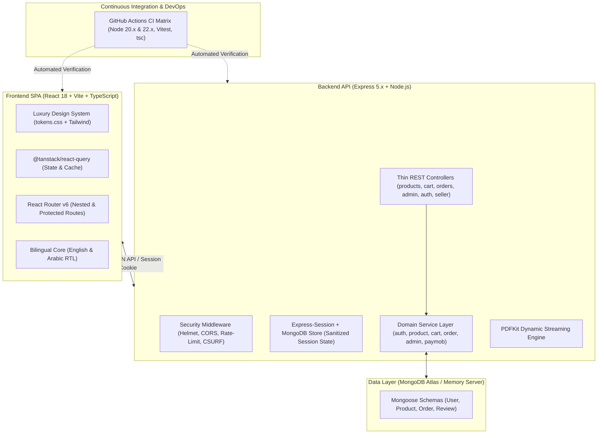

# Atelier Market — Luxury Artisanal Marketplace & Multi-Vendor E-Commerce Platform

[-10b981?style=for-the-badge&logo=vitest&logoColor=white)](https://github.com/nooremeel/Atelier-Market/tree/main/test)
[](https://github.com/nooremeel/Atelier-Market/blob/main/.github/workflows/ci.yml)
[](https://github.com/nooremeel/Atelier-Market/tree/main/client)
[](https://github.com/nooremeel/Atelier-Market/blob/main/services/paymobService.js)
[](https://github.com/nooremeel/Atelier-Market)
[](https://github.com/nooremeel/Atelier-Market/blob/main/package.json)

**Atelier Market** is a bespoke, enterprise-grade multi-vendor e-commerce platform and artisanal marketplace engineered to connect master craft studios across the Gulf and Levant regions with global patrons.

Designed to demonstrate production-grade full-stack architecture, conversion-rate optimization (CRO), multi-role workflows, and clean code standards.

---

## ⚡ 30-Second Client Demo & Persona Switcher

The application features an instant **1-Click Demo Persona Bar** on `/login` and a persistent top-tier demo switcher, allowing prospective clients and technical leads to evaluate the platform across all three core commercial roles with zero signup friction:

| Persona | Role | Email | Password | Key Capabilities Demonstrated |
| :--- | :--- | :--- | :--- | :--- |
| **Sara Hassan** | **Collector Patron** (Customer) | `sara@example.com` | `Demo1234!` | Browse catalog, choose product variants, slide-over mini cart, promo codes, 3-step checkout, Paymob credit card vault (3D-Secure), visual delivery tracking, PDF invoices. |
| **Layla Al-Rashidi** | **Artisan Seller** (Multi-Vendor Studio) | `layla@ateliermarket.com` | `Demo1234!` | Studio KPI dashboard, catalog pieces CRUD with stock thresholds, order status progression (`crafting`, `shipped`, Aramex tracking numbers). |
| **Admin Director** | **Platform Admin** (Director) | `admin@ateliermarket.com` | `Demo1234!` | Marketplace-wide GMV analytics, cross-platform orders monitor, artisan directory, cross-studio piece audit, system health. |

> **Demo Mode Notice**: Instant demo personas and automatic account bootstrapping/resets are active when `DEMO_MODE=true` is set in the environment (configured in Vercel project settings for live showcase evaluations). In standard production or non-demo environments where `DEMO_MODE` is unset or `false`, demo bootstrapping and credential resets are disabled to safeguard production data.

---

## 💎 Core Commercial & Engineering Features

### 1. Slide-Over Mini Cart Drawer & Conversion-Rate Optimization (CRO)
* **Slide-Over Cart Drawer**: Adding pieces smoothly slides open a luxury mini bag drawer from the side, providing immediate item feedback without navigating away from the browsing flow.
* **Instant Quantity Stepper Manipulation**: Collectors can adjust quantities, select custom options, view subtotal updates in real time, and click "Proceed to Checkout" directly.
* **Regional Free Shipping Progress Meter**: An animated gold-leaf meter calculates distance to the **$150 USD** free delivery threshold (*"Add $XX.XX more to unlock Complimentary Express Courier!"*), transitioning into a celebratory unlocked badge upon qualification.
* **Mobile Sticky "Add to Bag" Bottom Sheet**: Built with `IntersectionObserver`, detecting when the primary CTA scrolls past the mobile viewport to present a compact fixed purchase sheet with piece thumbnail, active variant, live price, and an instant CTA button.

### 2. Multi-Role RBAC & Centralized Platform Administration
* **Role-Based Access Control**: Strict multi-tenant authorization separating Patron Customers, Artisan Sellers, and Platform Administrators.
* **Platform Analytics Suite (`/admin/dashboard`)**: Aggregates Gross Merchandise Value (GMV), total marketplace orders, active pieces count, top-performing artisan studios, and recent cross-seller transactions.
* **Marketplace Orders Audit (`/admin/orders`)**: Real-time cross-vendor order inspection drawer with collector dossiers, studio breakdowns, tracking links, and PDF invoice generation.
* **Artisans Directory (`/admin/artisans`)**: Directory of verified studios across the Gulf & Levant with regional badges, joined dates, and catalog piece audits.

### 3. Inventory Protection & Out-of-Stock Engine
* **Atomic Stock Decrements**: Inventory validation on `/api/cart` and atomic decrement (`$inc: { stock: -quantity }`) on `/api/orders` to prevent over-selling and race conditions.
* **Dynamic Scarcity Signals**: Amber urgency badges (*"Only X left in studio"*) displayed when stock drops below threshold (`lowStockThreshold <= 5`), with automated *"Sold Out"* state, disabled CTAs, and archival grayscale imagery when depleted.

### 4. Visual Order Lifecycle & Delivery Tracker
* **Multi-Stage Delivery Stepper**: Visual 4-stage tracking flow (`01 CONFIRMED` ➔ `02 IN STUDIO` ➔ `03 DISPATCHED` ➔ `04 DELIVERED`).
* **Studio Provenance Timeline**: Chronological event logs with timestamps, carrier tracking codes (e.g., Aramex White-Glove Courier), and milestone notes appended directly by the crafting artisan.
* **1-Click Tracking Copy**: Instant clipboard copy with animated visual feedback.

### 5. Enterprise Product Variants Schema
* **Flexible Multi-SKU Architecture**: Products support custom dimensions (volumes, framing options, scent profiles) with distinct SKUs, individual stock levels, compare-at pricing, and separate cart line-item serialization.
* **Interactive Variant Pill Selector**: Luxury pill UI with dynamic pricing, compare-at discounts, and real-time inventory checks.

### 6. Interactive Leaflet Geolocation Studio Mapping
* **Artisan Atlas (`/map`)**: Interactive Leaflet/OpenStreetMap interface mapping heritage workshops in Riyadh, Damascus, Beirut, Cairo, and Muscat.
* **Contextual Geocoding**: Direct links between catalog piece pages and geographic workshop origins.

### 7. Memory-Efficient PDF Invoice Streaming
* **Dynamic Buffer Streaming**: Official archival PDF invoices generated on-the-fly using `pdfkit` and piped directly to the response stream without lingering disk storage.

### 8. Production Hardening, SEO & Security
* **Schema.org Structured Data**: Automatic injection of `<script type="application/ld+json">` for Google Product Rich Snippets (pricing, availability, aggregate rating).
* **Social Sharing Previews**: OpenGraph and Twitter Card meta tags configured for high-fidelity previews on Twitter, LinkedIn, and WhatsApp.
* **Rate Limiting & Cryptographic Cookies**: `express-rate-limit` deployed on authentication gateways; sessions signed with cryptographically secure 256-bit secrets via `crypto.randomBytes`.
* **Cross-Platform Test Reliability**: Vitest configuration hardened with `fileParallelism: false` to eliminate database port collisions across Windows, macOS, and Linux CI.

### 9. Paymob Payment Gateway Integration & Luxury Vault
* **Complete Financial Pipeline**: Seamlessly implements the 3-step Paymob financial workflow — Ephemeral Auth Token generation, Order Registration in piasters (cents), Payment Key Token issuance, and Bank 3D-Secure (3DS) ACS authorization.
* **Atelier Noir Luxury Payment Vault**: Custom high-fidelity modal dialog featuring real-time Luhn algorithm card validation, live brand detection (Visa, Mastercard, American Express), and dynamic interactive card preview matching luxury direct-to-consumer standards.
* **Dual Execution Rails**: Direct card API submission with smooth bank OTP challenge redirection, alongside an instant toggle to inspect the official Paymob hosted iframe container.
* **HMAC-SHA512 Cryptographic Webhook Security**: Server-to-server webhook endpoint (`POST /api/paymob/webhook`) cryptographically verified against Paymob's 20-field lexical ordering signature to prevent man-in-the-middle or price-tampering attacks.
* **Fail-Safe Browser Return & Active Reconciliation**: Dynamic redirection callback (`ALL /api/paymob/callback`) supporting cross-environment URL resolution with celebratory status banners. Active transaction inquiry (`inquirePaymobOrder`) reconciles unconfirmed orders and empties carts even if a customer uses browser back buttons.
* **Strict RTL/LTR Isolation**: Dedicated bidirectional layout isolation ensuring card numbers, expiry dates, and CVVs preserve proper cursor tracking and numerical formatting under Arabic RTL mode.

### 10. Service-Oriented Architecture, Clean Code & Automated CI (Phase 8 Refactoring)
* **Decoupled Domain Service Layer**: Extracted core business logic out of controllers into dedicated, testable domain services (`services/authService.js`, `services/productService.js`, `services/cartService.js`, `services/orderService.js`, `services/adminService.js`, `services/paymobService.js`). Controllers now strictly serve as thin HTTP adapters validating requests and formatting JSON responses.
* **Controller Modularization & Facade Pattern**: Monolithic `controllers/shop.js` (23.8KB) decomposed into single-responsibility domain controllers (`controllers/products.js`, `controllers/cart.js`, `controllers/orders.js`), with `controllers/shop.js` acting as a backward-compatible facade.
* **Async/Await Uniformity**: Refactored asynchronous flows across the backend to eliminate mixed `.then()/.catch()` promise chains in favor of clean `async/await` and standardized `next(err)` error handling.
* **Automated Multi-Version CI Matrix**: Configured GitHub Actions workflow ([`.github/workflows/ci.yml`](.github/workflows/ci.yml)) running parallel matrix builds across Node.js `20.x` and `22.x` on `ubuntu-latest`. Enforces deterministic `npm ci`, in-memory MongoDB backend integration tests, client component tests, TypeScript strict checks (`tsc -b`), and Vite production bundle builds with auto-cancellation for superseded runs.
* **Hardened Demo Bootstrap & Minimal Sessions**: Demo persona bootstrapping and password resets are strictly gated behind `DEMO_MODE=true` environment guards. Session storage was audited and minimized from entire Mongoose documents to sanitized `{ _id, role }` tokens to eliminate credential leakage.
* **Bootstrap & Seeding Decoupling**: Streamlined `server.js` from 35.6KB down to a lean ~65-line bootstrap entry point with graceful shutdown handling (`SIGINT`, `SIGTERM`), extracting all seed identities, catalogs, reviews, and migration backfills into `scripts/seedDemoData.js`.
* **Hybrid Token-Driven Tailwind Architecture**: Codified single source of truth in `client/src/design-system/tokens.css`, dynamically bound to `client/tailwind.config.ts` via RGB color channels (`rgb(var(--color-*-rgb) / <alpha-value>)`) to deliver dynamic alpha transparency, high-contrast dark mode switching, and 100% token consistency across 1,800+ JSX utility classes.
* **Dependency & Workspace Pruning**: Purged 70+ legacy transitive packages by eliminating unused SQL connectors (`mysql2`, `sequelize`) and server-side template engines (`pug`, `ejs`, `express-handlebars`). Cleaned obsolete root media and static disk invoice PDFs in favor of dynamic in-memory buffer streaming.

---

## 🛠️ Architecture & Tech Stack



### Technology Breakdown
* **Frontend**: React 18, TypeScript (Strict), Vite, TailwindCSS (custom luxury tokens via CSS variables & RGB channels: Gold Leaf, Sand, Silk, Plaster, Najd Black), React Router 6, TanStack Query v5, Leaflet, MSW (Mock Service Worker).
* **Backend**: Node.js, Express 5.x, Mongoose / MongoDB Atlas, Domain Service Layer (`services/*`), Paymob Accept Gateway API (Card 3DS & Webhooks), Multer, PDFKit, Helmet, Compression, Morgan, Express-Rate-Limit, Express-Validator.
* **DevOps, Testing & Quality Assurance**: GitHub Actions CI ([`.github/workflows/ci.yml`](.github/workflows/ci.yml)), Vitest (109 backend + 173 frontend tests · 100% passing), React Testing Library, Supertest, MongoDB Memory Server.

---

## 🧪 Automated Test Suite (282 Tests · 100% Pass)

The application maintains comprehensive automated test coverage across client components, domain services, and backend REST endpoints:

```bash
# Run backend integration & service tests (18 test files, 109 tests)
npm test

# Run frontend React component tests (55 test files, 173 tests)
npm --prefix client test

# Run TypeScript strict typecheck & client build
npm run client:build
```

All test suites and production build scripts are continuously executed on every push and pull request via [GitHub Actions CI](.github/workflows/ci.yml) against Node.js 20.x and 22.x.

---

## 🚀 Local Development Setup

### Prerequisites
* Node.js >= 20.x
* npm >= 10.x

### 1. Clone the Repository
```bash
git clone https://github.com/nooremeel/Atelier-Market.git
cd Atelier-Market
```

### 2. Install Dependencies
```bash
# Installs root dependencies and automatically runs client postinstall
npm install
```

### 3. Environment Configuration
Create a `.env` file in the project root:
```ini
PORT=3000
NODE_ENV=development
SESSION_SECRET=atelier_market_super_secret_session_key_2026_secure
MONGODB_URI=mongodb+srv://<username>:<password>@cluster0.example.mongodb.net/shop

# Demo Persona Bootstrap (Set DEMO_MODE=true only in showcase/demo environments such as Vercel)
DEMO_MODE=false

# Paymob Payment Gateway (Optional: defaults to offline simulation if unconfigured)
PAYMOB_SANDBOX_MODE=false
PAYMOB_API_KEY=your_paymob_account_jwt_token
PAYMOB_SECRET_KEY=egy_sk_test_...
PAYMOB_PUBLIC_KEY=egy_pk_test_...
PAYMOB_INTEGRATION_ID=your_card_integration_id
PAYMOB_HMAC_SECRET=your_paymob_hmac_secret
PAYMOB_IFRAME_ID=your_iframe_id
PAYMOB_CURRENCY=EGP
APP_URL=http://localhost:5173
```

### 4. Run Development Servers
```bash
# Terminal 1: Backend Express API (Runs on http://localhost:3000)
npm run dev

# Terminal 2: React Vite SPA (Runs on http://localhost:5173 with auto-proxy)
npm run client:dev
```

### 5. Production Build & Execution
```bash
# Build the React SPA into public/app/
npm run client:build

# Start unified production server (serves API & SPA on http://localhost:3000)
npm start
```

---

## 📋 Project Structure

```text
Atelier-Market/
├── .github/
│   └── workflows/
│       └── ci.yml              # Automated CI matrix (Node 20.x/22.x, Vitest, tsc, build)
├── client/                     # React 18 + TypeScript SPA
│   ├── src/
│   │   ├── components/         # Shared design system components (Drawer, FreeShippingMeter, etc.)
│   │   ├── design-system/      # tokens.css (Token Authority) & global.css
│   │   ├── features/           # Domain feature folders (admin, auth, cart, orders, products, seller)
│   │   ├── lib/                # API client, i18n, Theme, Image helpers
│   │   └── router.tsx          # App routing & role guards
│   └── tailwind.config.ts      # Hybrid token-driven Tailwind configuration
├── controllers/                # Thin Express Controllers (Validation & HTTP Serialization)
│   ├── adminController.js      # Platform Admin stats & catalog audits
│   ├── auth.js                 # Authentication & session dispatch
│   ├── cart.js                 # Cart line-item mutations
│   ├── orders.js               # Order placement & PDF streaming
│   ├── products.js             # Catalog discovery & product details
│   ├── sellerController.js     # Artisan seller management & tracking
│   └── shop.js                 # Backward-compatible shop facade
├── services/                   # Decoupled Domain Service Layer
│   ├── adminService.js         # Marketplace GMV & directory aggregations
│   ├── authService.js          # Credential auth, demo provisioning, reset tokens
│   ├── cartService.js          # Cart serialization & stock validation
│   ├── orderService.js         # Order creation, atomic stock, reconciliation
│   ├── paymobService.js        # 3DS vault, webhooks, HMAC-SHA512 verification
│   └── productService.js       # Catalog filters, pagination, piece CRUD
├── models/                     # Mongoose Data Schemas (User, Product, Order, Review)
├── routes/                     # Express API Route Definitions
├── scripts/                    # Maintenance & Seed Scripts
│   ├── cleanSaraOrders.js      # Demo patron order history cleanup
│   └── seedDemoData.js         # Comprehensive demo dataset bootstrap
├── util/                       # PDF Invoice Generator & DB Connection Singleton
├── test/                       # Backend Supertest & Vitest Suite (18 files, 109 tests)
├── app.js                      # Canonical Express application configuration
└── server.js                   # Minimal bootstrap server (~65 lines)
```

---

## ⚖️ License

This project is licensed under the [ISC License](https://github.com/nooremeel/Atelier-Market/blob/main/package.json).
